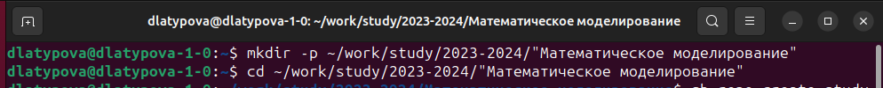
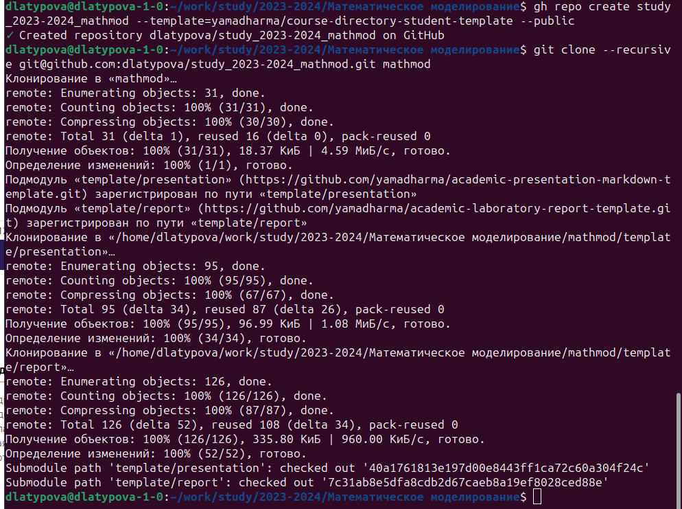
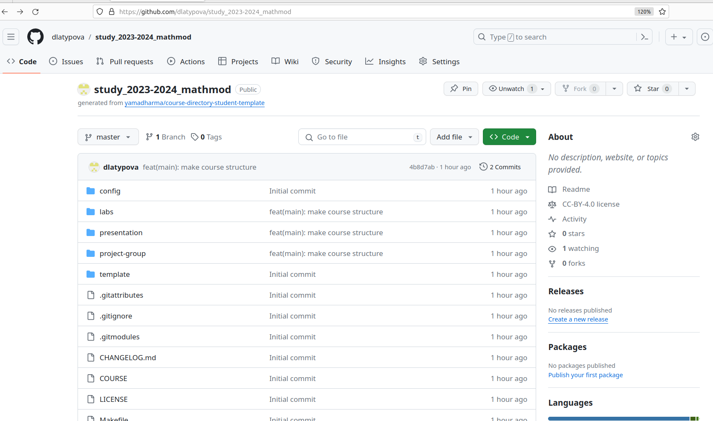
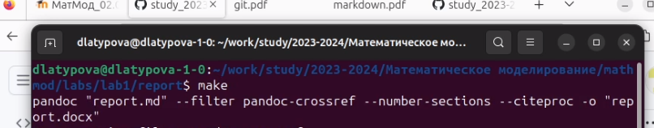

---
## Front matter
lang: ru-RU
title: Лабораторная работа №1. Вспомнить все.
author:
  - Латыпова Диана. НФИбд-02-21.
institute:
  - Российский университет дружбы народов имени Патриса Лумумбы, Москва, Россия

## i18n babel
babel-lang: russian
babel-otherlangs: english

## Formatting pdf
toc: false
toc-title: Содержание
slide_level: 2
aspectratio: 169
section-titles: true
theme: metropolis
header-includes:
 - \metroset{progressbar=frametitle,sectionpage=progressbar,numbering=fraction}
 - '\makeatletter'
 - '\beamer@ignorenonframefalse'
 - '\makeatother'
---

## Цели и задачи

Вспомнить как работать с git и markdown.

- Сделать отчёт по лабораторной работе №1 в формате Markdown.
- В качестве отчёта предоставить отчёты в 3 форматах: pdf, docx и md.

## Теоретическое введение

## Git
_Git_ - это система управления версиями, которая используется для отслеживания изменений в коде или любых других файлах. Она позволяет разработчикам работать совместно над проектами, отслеживать изменения, вносить правки и контролировать доступ к коду.

## Ключевые понятия:

- Репозиторий (Repository): Это место, где хранятся файлы и история изменений проекта.
- Коммит (Commit): Это фиксация изменений в репозитории. Каждый коммит содержит информацию о том, что было изменено и кто внёс изменения.
- Ветвь (Branch): Это параллельная линия разработки, позволяющая работать над функциональностью независимо от других разработчиков.
- Слияние (Merge): Процесс объединения изменений из одной ветви в другую.
- Конфликт (Conflict): Это ситуация, когда Git не может автоматически объединить изменения из-за противоречий в коде.

## Основные команды:

- git init: Создает новый репозиторий.
- git clone: Клонирует репозиторий с удаленного сервера.
- git add: Добавляет файлы в индекс для последующего коммита.
- git commit: Фиксирует изменения в репозитории.
- git push: Отправляет изменения на удаленный сервер.
- git pull: Получает изменения с удаленного сервера и объединяет их с локальными.

## Markdown

_Markdown_ - это легкий язык разметки, который позволяет создавать форматированный текст с помощью простых символов и синтаксиса. Он часто используется для написания README файлов, веб-страниц, электронных писем и других документов.

## Основные элементы синтаксиса:

- Заголовки: Создаются с помощью символов #. Например, # Заголовок 1.
- Списки: Маркированные списки создаются с помощью *, - или +, а нумерованные списки - с помощью числовых значений с точкой.
- Ссылки: Форматируются в виде [текст ссылки](URL).
- Изображения: Вставляются с помощью .
- Выделение текста: Можно использовать * или _ для выделения текста курсивом, и ** или __ для выделения текста жирным шрифтом.
- Код: Код внутри строки отмечается с помощью ``, а блочный код - с помощью отступов или тройного обратного апострофа (```).

## Выполнение лабораторной работы

Для начала я создала пространство в следующей иерархии с помощью команды mkdir  (рис. [-@fig:001]):

{#fig:001 width=60%}

## Залогинилась

Залогинилась в гитхабе (рис. [-@fig:003]) (рис. [-@fig:004])

{#fig:003 width=60%}

{#fig:004 width=50%}

## Успех

Успешно создался репозиторий
(рис. [-@fig:006]).

{#fig:006 width=70%}

## make

Выполнила команду make
(рис. [-@fig:007]).

{#fig:007 width=70%}


## Выводы

Я успешно вспомнила как работать с git и markdown.

