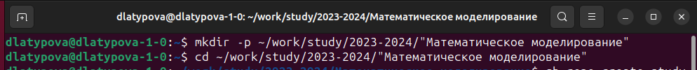
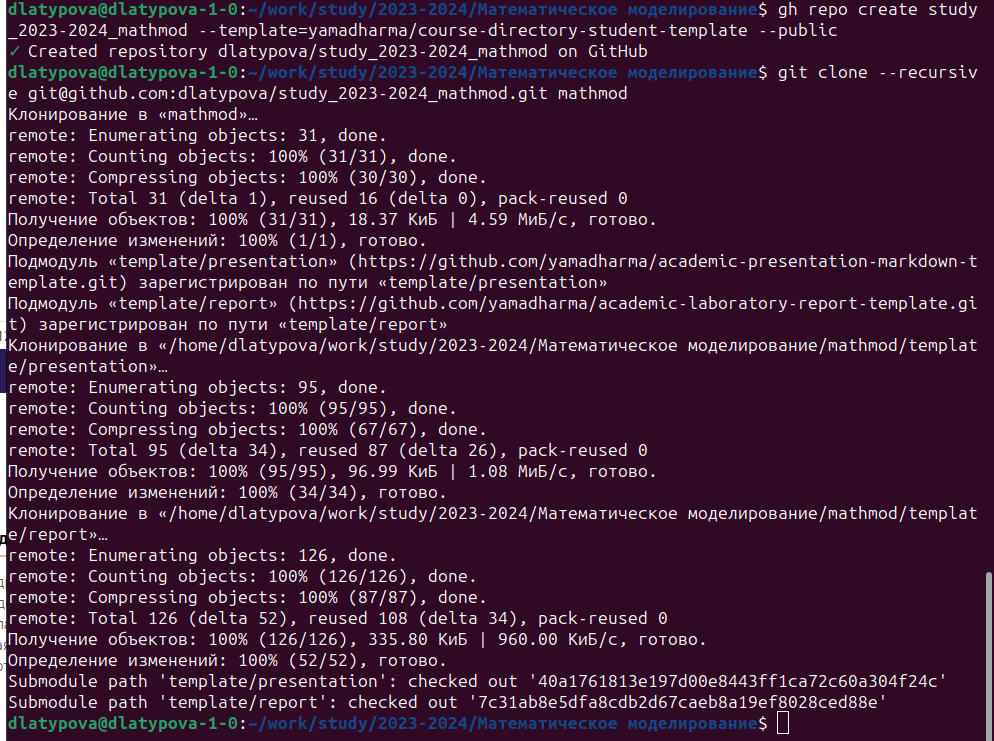
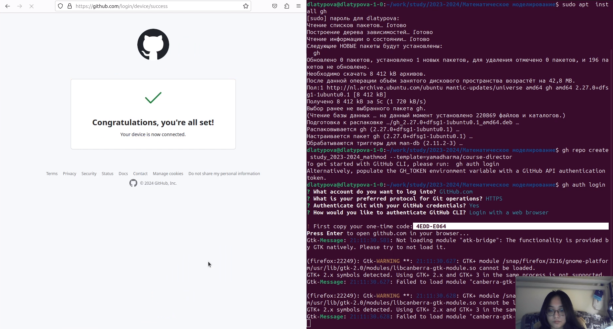
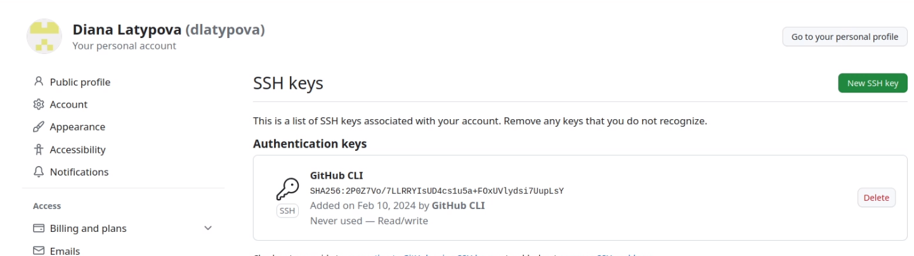
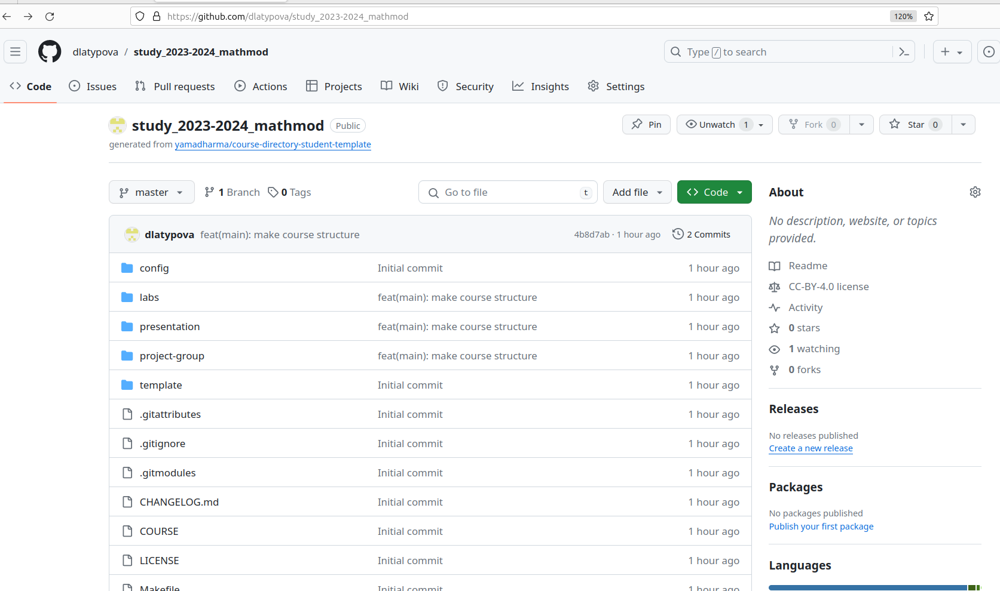
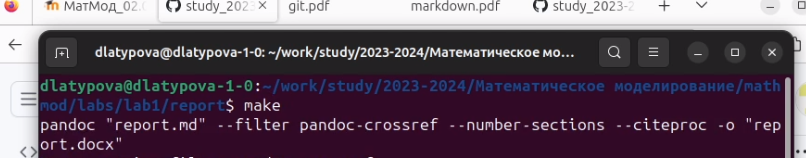

---
## Front matter
title: "Лабораторная работа №1"
subtitle: "Работа с Git и Markdown"
author: "Латыпова Диана. НФИбд-02-21"

## Generic otions
lang: ru-RU
toc-title: "Содержание"

## Bibliography
bibliography: bib/cite.bib
csl: pandoc/csl/gost-r-7-0-5-2008-numeric.csl

## Pdf output format
toc: true # Table of contents
toc-depth: 2
lof: true # List of figures
lot: true # List of tables
fontsize: 12pt
linestretch: 1.5
papersize: a4
documentclass: scrreprt
## I18n polyglossia
polyglossia-lang:
  name: russian
  options:
	- spelling=modern
	- babelshorthands=true
polyglossia-otherlangs:
  name: english
## I18n babel
babel-lang: russian
babel-otherlangs: english
## Fonts
mainfont: PT Serif
romanfont: PT Serif
sansfont: PT Sans
monofont: PT Mono
mainfontoptions: Ligatures=TeX
romanfontoptions: Ligatures=TeX
sansfontoptions: Ligatures=TeX,Scale=MatchLowercase
monofontoptions: Scale=MatchLowercase,Scale=0.9
## Biblatex
biblatex: true
biblio-style: "gost-numeric"
biblatexoptions:
  - parentracker=true
  - backend=biber
  - hyperref=auto
  - language=auto
  - autolang=other*
  - citestyle=gost-numeric
## Pandoc-crossref LaTeX customization
figureTitle: "Рис."
tableTitle: "Таблица"
listingTitle: "Листинг"
lofTitle: "Список иллюстраций"
lotTitle: "Список таблиц"
lolTitle: "Листинги"
## Misc options
indent: true
header-includes:
  - \usepackage{indentfirst}
  - \usepackage{float} # keep figures where there are in the text
  - \floatplacement{figure}{H} # keep figures where there are in the text
---

# Цель работы

Вспомнить как работать с git и markdown.

# Задание

- Сделать отчёт по лабораторной работе №1 в формате Markdown.
- В качестве отчёта предоставить отчёты в 3 форматах: pdf, docx и md.

# Теоретическое введение

_Git_ - это система управления версиями, которая используется для отслеживания изменений в коде или любых других файлах. Она позволяет разработчикам работать совместно над проектами, отслеживать изменения, вносить правки и контролировать доступ к коду.

Ключевые понятия:

- Репозиторий (Repository): Это место, где хранятся файлы и история изменений проекта.
- Коммит (Commit): Это фиксация изменений в репозитории. Каждый коммит содержит информацию о том, что было изменено и кто внёс изменения.
- Ветвь (Branch): Это параллельная линия разработки, позволяющая работать над функциональностью независимо от других разработчиков.
- Слияние (Merge): Процесс объединения изменений из одной ветви в другую.
- Конфликт (Conflict): Это ситуация, когда Git не может автоматически объединить изменения из-за противоречий в коде.

Основные команды:

- git init: Создает новый репозиторий.
- git clone: Клонирует репозиторий с удаленного сервера.
- git add: Добавляет файлы в индекс для последующего коммита.
- git commit: Фиксирует изменения в репозитории.
- git push: Отправляет изменения на удаленный сервер.
- git pull: Получает изменения с удаленного сервера и объединяет их с локальными.

_Markdown_ - это легкий язык разметки, который позволяет создавать форматированный текст с помощью простых символов и синтаксиса. Он часто используется для написания README файлов, веб-страниц, электронных писем и других документов.

Основные элементы синтаксиса:

- Заголовки: Создаются с помощью символов #. Например, # Заголовок 1.
- Списки: Маркированные списки создаются с помощью *, - или +, а нумерованные списки - с помощью числовых значений с точкой.
- Ссылки: Форматируются в виде [текст ссылки](URL).
- Изображения: Вставляются с помощью .
- Выделение текста: Можно использовать * или _ для выделения текста курсивом, и ** или __ для выделения текста жирным шрифтом.
- Код: Код внутри строки отмечается с помощью ``, а блочный код - с помощью отступов или тройного обратного апострофа (```).

Markdown позволяет создавать чистый и читаемый текстовый формат, который легко преобразуется в HTML или другие форматы разметки.

# Выполнение лабораторной работы

Для начала я создала пространство в следующей иерархии с помощью команды mkdir  (рис. [-@fig:001]):

- ~/work/study/
  - 2023-2024/
    - Математическое моделирование/
        - mathmod/

{#fig:001 width=70%}

Создала с помощью утилит репозиторий курса на основе шаблона https://github.com/yamadharma/course-directory-student-template.
(рис. [-@fig:002])

{#fig:002 width=70%}

Залогинилась в гитхабе (рис. [-@fig:004])

(рис. [-@fig:003]).

{#fig:003 width=70%}

{#fig:004 width=70%}

Увидели, как добавился ssh ключ
(рис. [-@fig:005]).

{#fig:005 width=70%}

Успешно создался репозиторий
(рис. [-@fig:006]).

{#fig:006 width=70%}

Выполнила команду make
(рис. [-@fig:007]).

{#fig:007 width=70%}


# Выводы

Я успешно вспомнила как работать с git и markdown.

