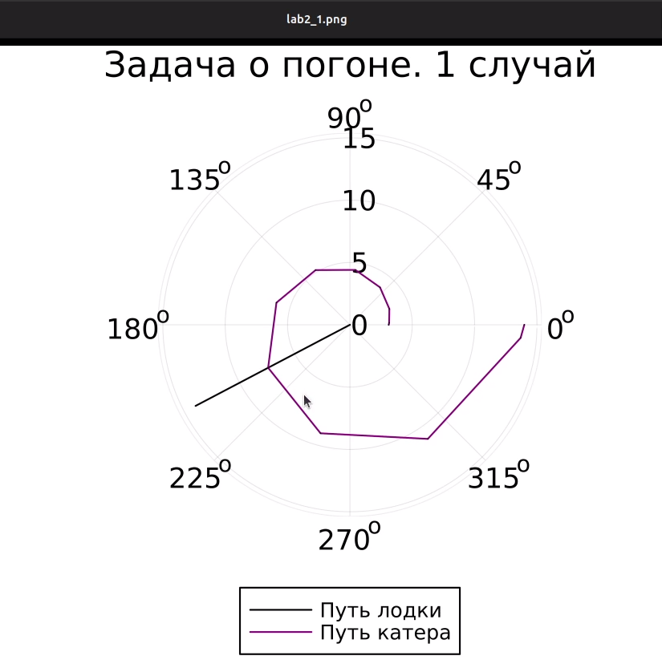
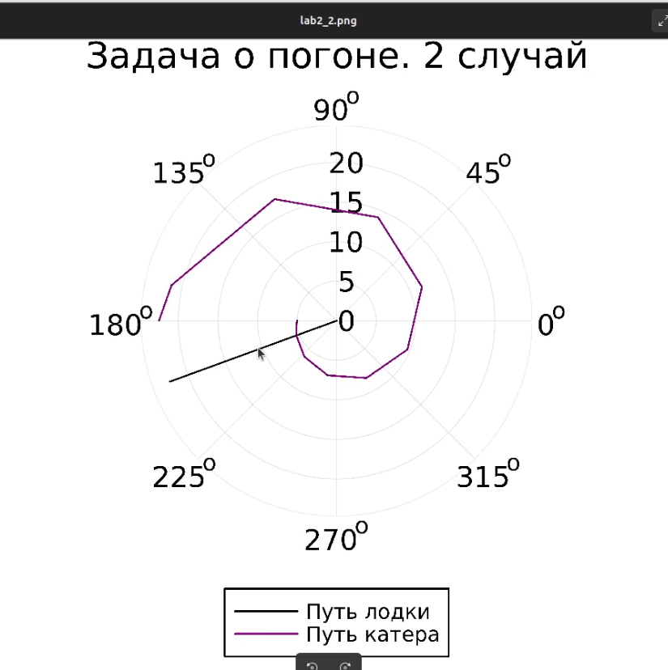

---
## Front matter
lang: ru-RU
title: Лабораторная работа №2
subtitle: Задача о погоне
author:
  - Латыпова Диана. НФИбд-02-21
institute:
  - Российский университет дружбы народов имени Патриса Лумумбы, Москва, Россия
date: 2024

## i18n babel
babel-lang: russian
babel-otherlangs: english

## Formatting pdf
toc: false
toc-title: Содержание
slide_level: 2
aspectratio: 169
section-titles: true
theme: metropolis
header-includes:
 - \metroset{progressbar=frametitle,sectionpage=progressbar,numbering=fraction}
 - '\makeatletter'
 - '\beamer@ignorenonframefalse'
 - '\makeatother'
---

# Вводная часть

## Цель работы

Реализовать задачу о погоне. Изучить язык программирования Julia.

## Задание
Мой вариант - 46.

*Условие задачи о погоне*

На море в тумане катер береговой охраны преследует лодку браконьеров.
Через определенный промежуток времени туман рассеивается, и лодка
обнаруживается на расстоянии 16,5 км от катера. Затем лодка снова скрывается в
тумане и уходит прямолинейно в неизвестном направлении. Известно, что скорость
катера в 4,3 раза больше скорости браконьерской лодки.

1. Запишите уравнение, описывающее движение катера, с начальными
условиями для двух случаев (в зависимости от расположения катера
относительно лодки в начальный момент времени).
2. Постройте траекторию движения катера и лодки для двух случаев.
3. Найдите точку пересечения траектории катера и лодки 

## Теоретическое введение

*Задача о погоне* - это классическая задача оптимизации, в которой группа охотников пытается поймать добычу (например, зайца), который быстрее их. Они могут двигаться с разной скоростью, и их цель - сделать так, чтобы добыча никогда не смогла достичь безопасного убежища.
*Решение задачи* о погоне часто включает в себя использование алгоритмов оптимизации или алгоритмов поиска, чтобы найти оптимальные стратегии для охотников. Это может включать в себя моделирование движения добычи и охотников, определение оптимальных путей и принятие решений на основе текущих условий.

## Задача о погоне в программировании
В контексте программирования задачу о погоне можно решить, используя различные методы оптимизации, такие как генетические алгоритмы, методы градиентного спуска или алгоритмы поиска в пространстве состояний. Эти методы могут быть реализованы на языках программирования, таких как Python, Julia или MATLAB, и использоваться для симуляции и анализа различных стратегий охотников и добычи.

*Julia* - это высокопроизводительный динамический язык программирования, разработанный для численных и научных вычислений. Он объединяет простоту и выразительность Python с производительностью компилируемых языков, таких как C и Fortran. Julia позволяет писать чистый и читаемый код, который работает быстро.

# Выполнение лабораторной работы

## Выполнение лабораторной работы

*Построение математической модели*

1. Начнем с момента обнаружения лодки браконьеров, когда туман рассеялся. Вводим полярные координаты, где точка обнаружения лодки - полюс, а ось проходит через береговую охрану. Таким образом, координаты катера(16,5; 0)

2. Находим расстояние, при котором катер начнет двигаться вокруг полюса. Это происходит, когда катер и лодка находятся на одинаковом расстоянии от полюса.

## Выполнение лабораторной работы

3. Составляем систему уравнений, учитывая скорость движения лодки браконьеров и время, которое катер и лодка проводят на одинаковом расстоянии от полюса. За время $t$ лодка пройдет $x$, а катер береговой охраны $16.5-x$. Примем скорость лодки браконеров за $v$. Следовательно время будет равно $x\over v$ для лодки и $16.5-x\over 4.3 v$ или $16.5+x\over 4.3 v$ для катера. Учитывая, что время должно быть равно, получается:

$$
\left\{
\begin{array}{cc}
\dfrac{x}{v} = \dfrac{16.5 - x}{4.3v} \\\\
\dfrac{x}{v} = \dfrac{16.5 + x}{4.3v}
\end{array}
\right.
$$

Решив систему, мы получили два значения $x$: $x_{1} = {165\over53}$, а $x_{2} = {5}$

## Выполнение лабораторной работы

4. Когда катер достигает той же дистанции от полюса, что и лодка, он начинает движение вокруг полюса, удаляясь от лодки со скоростью $v$. Скорость $v$ раскладывается на 2 значения: $v_{r} = {dr\over dt}$ - радиальная скорость и $v_{\tau} = {r*{d{\theta}\over dt }}$ - тангенциальная скорость. 

5. Формулируем систему дифференциальных уравнений для определения радиальной и тангенциальной скоростей катера относительно полюса. Первое уравнение у нас уже есть: $v_{r} = {dr\over dt}$. Второе уравнение мы найдем из разложения скорости на две составляющие с помощью теоремы Пифагора:

$v_{\tau} = {\sqrt{(4.3v)^2 - v_{_r}^2}} = {\sqrt{18.49v^2 - v^2}} = {{\sqrt{1749}v}\over{10}} $

Следовательно второе уравнение выглядит так: ${r*{d{\theta}\over dt }} = {{\sqrt{1749}v}\over{10}} $

## Выполнение лабораторной работы

Тогда система уравнений получается: 

$$
\left\{
\begin{array}{cc}
\dfrac{dr}{dt} = {v} \\\\
\dfrac{r*{d{\theta}}}{dt} = {{\sqrt{1749}v}\over{10}} 
\end{array}
\right.
$$

С начальными условиями: 

## Первый случай
$$
\left\{
\begin{array}{cc}
{\theta = 0} \\\\
{r_{0}} = {165\over53}
\end{array}
\right.
$$

## Первый случай
$$
\left\{
\begin{array}{cc}
{\theta = -\pi} \\\\
{r_{0}} = {5}
\end{array}
\right.
$$

## Выполнение лабораторной работы

Путем математичсеких манипуляций приводим систему к такому виду: 

${dr\over d\theta} = {10r\over {\sqrt{1749}}}$

Математическая модель готова.

# Графическое представление

После запуска кода, сгенерировалось 2 картинки(2 случая)

## Случай 1

Случай 1 - Катер впереди лодки (рис. [-@fig:005]):

{#fig:005 width=60%}
Исходя из случа1 на картинке мы видим, что полярный радиус равен 7, а полярный угол равен 210 градусов.

## Случай 2

Случай 2 - Катер позади лодки (рис. [-@fig:006]):

{#fig:006 width=60%}
Исходя из случа2 на картинке мы видим, что полярный радиус равен 5.1, а полярный угол равен 202.5 градусов.

## Выводы

Я реализовала (решила) задачу о погоне варианта 46. Кроме того, теперь знаю основы языка программирования Julia.
