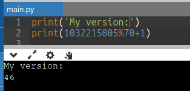
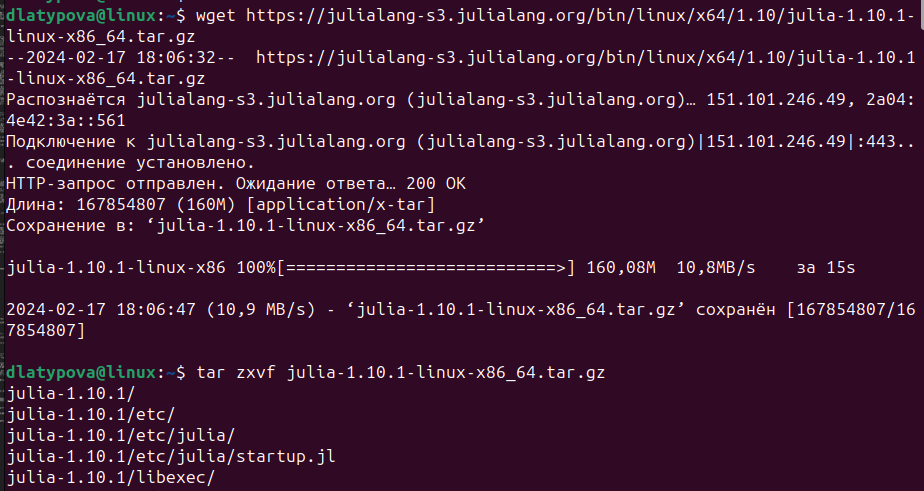
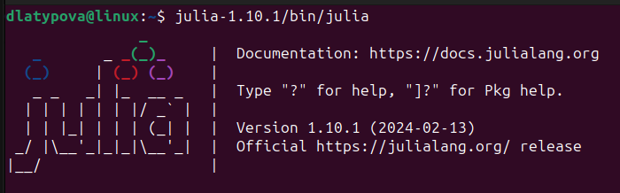
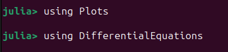
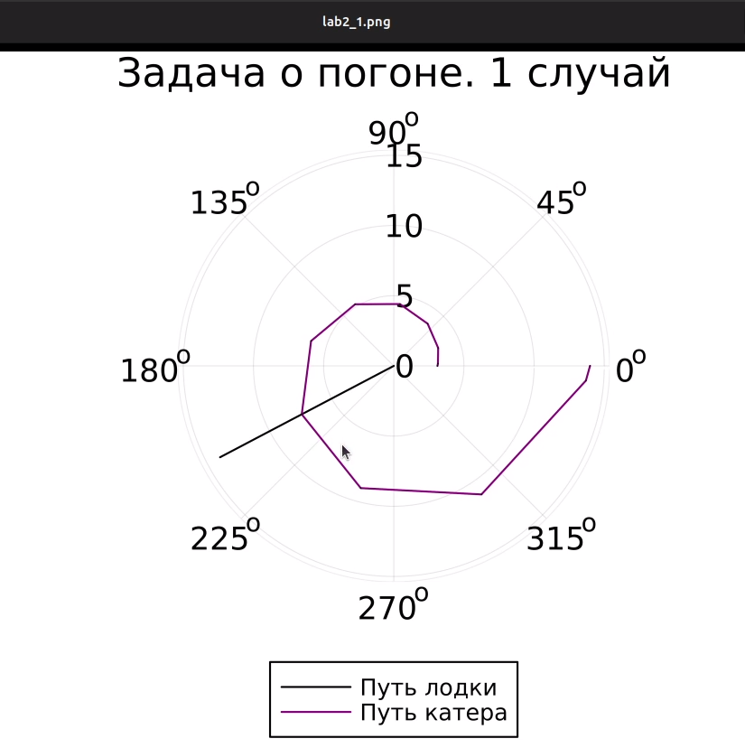
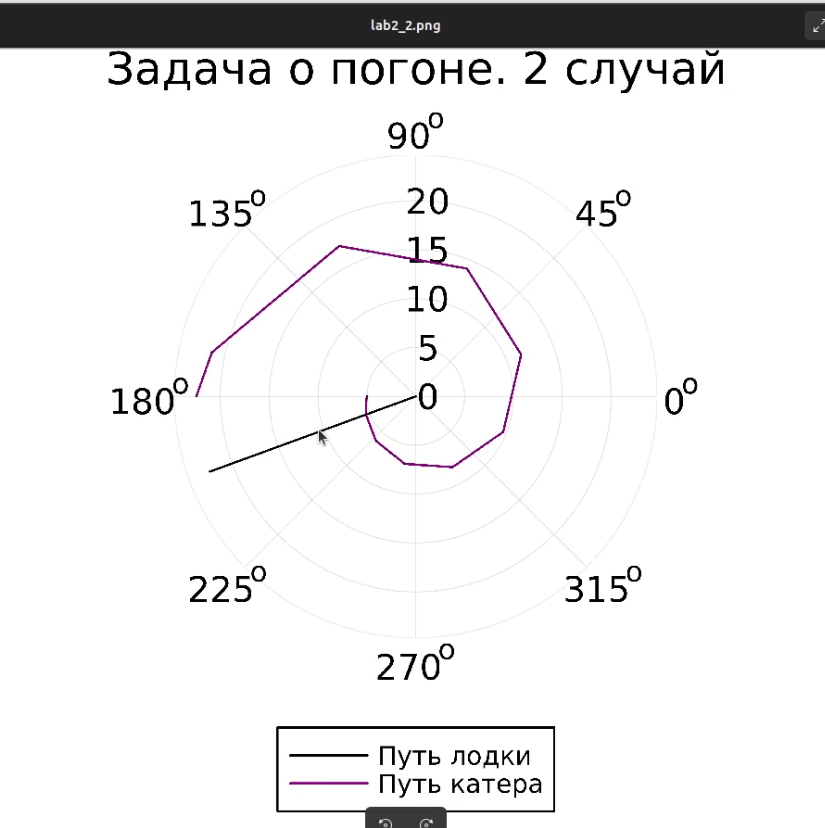

---
## Front matter
title: "Отчёт по лабораторной работе №2"
subtitle: "Заача о погоне"
author: "Латыпова Диана. НФИбд-02-21"

## Generic otions
lang: ru-RU
toc-title: "Содержание"

## Bibliography
bibliography: bib/cite.bib
csl: pandoc/csl/gost-r-7-0-5-2008-numeric.csl

## Pdf output format
toc: true # Table of contents
toc-depth: 2
lof: true # List of figures
lot: true # List of tables
fontsize: 12pt
linestretch: 1.5
papersize: a4
documentclass: scrreprt
## I18n polyglossia
polyglossia-lang:
  name: russian
  options:
	- spelling=modern
	- babelshorthands=true
polyglossia-otherlangs:
  name: english
## I18n babel
babel-lang: russian
babel-otherlangs: english
## Fonts
mainfont: PT Serif
romanfont: PT Serif
sansfont: PT Sans
monofont: PT Mono
mainfontoptions: Ligatures=TeX
romanfontoptions: Ligatures=TeX
sansfontoptions: Ligatures=TeX,Scale=MatchLowercase
monofontoptions: Scale=MatchLowercase,Scale=0.9
## Biblatex
biblatex: true
biblio-style: "gost-numeric"
biblatexoptions:
  - parentracker=true
  - backend=biber
  - hyperref=auto
  - language=auto
  - autolang=other*
  - citestyle=gost-numeric
## Pandoc-crossref LaTeX customization
figureTitle: "Рис."
tableTitle: "Таблица"
listingTitle: "Листинг"
lofTitle: "Список иллюстраций"
lotTitle: "Список таблиц"
lolTitle: "Листинги"
## Misc options
indent: true
header-includes:
  - \usepackage{indentfirst}
  - \usepackage{float} # keep figures where there are in the text
  - \floatplacement{figure}{H} # keep figures where there are in the text
---

# Цель работы

Реализовать задачу о погоне. Изучить язык программирования Julia.

# Задание

По формуле из ТУИСа я выявила свой вариант: $(S_{n} mod N)+1$, где Sn — номер студбилета, N — количество заданий.
Мой вариант - 46. (рис. [-@fig:001])
{#fig:001 width=70%}

*Условие задачи о погоне*

На море в тумане катер береговой охраны преследует лодку браконьеров.
Через определенный промежуток времени туман рассеивается, и лодка
обнаруживается на расстоянии 16,5 км от катера. Затем лодка снова скрывается в
тумане и уходит прямолинейно в неизвестном направлении. Известно, что скорость
катера в 4,3 раза больше скорости браконьерской лодки.

1. Запишите уравнение, описывающее движение катера, с начальными
условиями для двух случаев (в зависимости от расположения катера
относительно лодки в начальный момент времени).
2. Постройте траекторию движения катера и лодки для двух случаев.
3. Найдите точку пересечения траектории катера и лодки 

# Теоретическое введение

*Задача о погоне* - это классическая задача оптимизации, в которой группа охотников пытается поймать добычу (например, зайца), который быстрее их. Они могут двигаться с разной скоростью, и их цель - сделать так, чтобы добыча никогда не смогла достичь безопасного убежища.
*Цель задачи* о погоне состоит в том, чтобы найти оптимальные стратегии для охотников, чтобы они смогли захватить добычу, прежде чем та достигнет безопасного места. Одной из возможных метрик успеха может быть время, затраченное на погоню, или расстояние, пройденное добычей до ее поймать.
*Решение задачи* о погоне часто включает в себя использование алгоритмов оптимизации или алгоритмов поиска, чтобы найти оптимальные стратегии для охотников. Это может включать в себя моделирование движения добычи и охотников, определение оптимальных путей и принятие решений на основе текущих условий.

В контексте программирования задачу о погоне можно решить, используя различные методы оптимизации, такие как генетические алгоритмы, методы градиентного спуска или алгоритмы поиска в пространстве состояний. Эти методы могут быть реализованы на языках программирования, таких как Python, Julia или MATLAB, и использоваться для симуляции и анализа различных стратегий охотников и добычи[@wiki:bash].

*Julia* - это высокопроизводительный динамический язык программирования, разработанный для численных и научных вычислений. Он объединяет простоту и выразительность Python с производительностью компилируемых языков, таких как C и Fortran. Julia позволяет писать чистый и читаемый код, который работает быстро[@aboutjulia:bash].

Особенности:

- Динамическая типизация: Julia является языком с динамической типизацией, что означает, что типы переменных определяются во время выполнения программы, а не во время компиляции.
- Высокая производительность: Благодаря специализированному компилятору, Julia предоставляет высокую производительность, сравнимую с языками низкого уровня, такими как C и Fortran.
- Многопоточность: Julia поддерживает параллельные вычисления и многопоточность, что позволяет эффективно использовать многопроцессорные системы.
- Широкие возможности: Julia имеет обширную стандартную библиотеку и активное сообщество разработчиков, что обеспечивает широкие возможности для научных вычислений, статистики, машинного обучения и других областей. 


Команды для установки последней версии Julia на Linux:
```
wget https://julialang-s3.julialang.org/bin/linux/x64/1.10/julia-1.10.1-linux-x86_64.tar.gz
tar zxvf julia-1.10.1-linux-x86_64.tar.gz
```
Запуск Julia:
<Julia directory>/bin/julia

В нашем случае:
julia-1.10.1/bin/julia

Для нашей задачи о полигоне понадобятся пакеты Plots и DifferentialEquations. Запустив Julia, для установки пакетов нужно ввести:
```
using Pkg
Pkg.add("Plots")
Pkg.add("DifferentialEquations")
```

# Выполнение лабораторной работы

*Построение математической модели*

1. Начнем с момента обнаружения лодки браконьеров, когда туман рассеялся. Вводим полярные координаты, где точка обнаружения лодки - полюс, а ось проходит через береговую охрану. Таким образом, координаты катера(16,5; 0)

2. Находим расстояние, при котором катер начнет двигаться вокруг полюса. Это происходит, когда катер и лодка находятся на одинаковом расстоянии от полюса.

3. Составляем систему уравнений, учитывая скорость движения лодки браконьеров и время, которое катер и лодка проводят на одинаковом расстоянии от полюса. За время $t$ лодка пройдет $x$, а катер береговой охраны $16.5-x$. Примем скорость лодки браконеров за $v$. Следовательно время будет равно $x\over v$ для лодки и $16.5-x\over 4.3 v$ или $16.5+x\over 4.3 v$ для катера. Учитывая, что время должно быть равно, получается:

$$
\left\{
\begin{array}{cc}
\dfrac{x}{v} = \dfrac{16.5 - x}{4.3v} \\\\
\dfrac{x}{v} = \dfrac{16.5 + x}{4.3v}
\end{array}
\right.
$$

Решив систему, мы получили два значения $x$: $x_{1} = {165\over53}$, а $x_{2} = {5}$

4. Когда катер достигает той же дистанции от полюса, что и лодка, он начинает движение вокруг полюса, удаляясь от лодки со скоростью $v$. Скорость $v$ раскладывается на 2 значения: $v_{r} = {dr\over dt}$ - радиальная скорость и $v_{\tau} = {r*{d{\theta}\over dt }}$ - тангенциальная скорость. 

5. Формулируем систему дифференциальных уравнений для определения радиальной и тангенциальной скоростей катера относительно полюса. Первое уравнение у нас уже есть: $v_{r} = {dr\over dt}$. Второе уравнение мы найдем из разложения скорости на две составляющие с помощью теоремы Пифагора:

$v_{\tau} = {\sqrt{(4.3v)^2 - v_{_r}^2}} = {\sqrt{18.49v^2 - v^2}} = {{\sqrt{1749}v}\over{10}} $

Следовательно второе уравнение выглядит так: ${r*{d{\theta}\over dt }} = {{\sqrt{1749}v}\over{10}} $

Тогда система уравнений получается: 

$$
\left\{
\begin{array}{cc}
\dfrac{dr}{dt} = {v} \\\\
\dfrac{r*{d{\theta}}}{dt} = {{\sqrt{1749}v}\over{10}} 
\end{array}
\right.
$$

С начальными условиями: 

(для первого случая)
$$
\left\{
\begin{array}{cc}
{\theta = 0} \\\\
{r_{0}} = {165\over53}
\end{array}
\right.
$$

(для второго случая)
$$
\left\{
\begin{array}{cc}
{\theta = -\pi} \\\\
{r_{0}} = {5}
\end{array}
\right.
$$

Путем математичсеких манипуляций приводим систему к такому виду: 

${dr\over d\theta} = {10r\over {\sqrt{1749}}}$

Математическая модель готова.

# Ход лабораторной работы

Для начала я установила Julia на Linux(рис. [-@fig:002]).

{#fig:002 width=70%}

Запустила Julia(рис. [-@fig:003]).

{#fig:003 width=70%}

Подключение пакетов Plots и DifferentialEquations (рис. [-@fig:004]).

{#fig:004 width=70%}

Написала код на языке Julia для реализации нашей задачи о погоне:
```
using Plots
using DifferentialEquations

# Расстояние от лодки до катера
const distance_to_kater = 16.5
const ratio = 4.3

# Расстояние начала спирали для движения катера впереди лодки и позади лодки
const r0_forward = distance_to_kater / (ratio + 1)
const r0_backward = distance_to_kater / (ratio - 1)

# Интервал для времени
const T = (0, 2*pi)         # Для движения катера впереди лодки
const T_backward = (-pi, pi)  # Для движения катера позади лодки

# Определение функции для уравнений движения
function F(u, p, t)
    return u / sqrt(ratio * ratio - 1)
end

# 1 случай: Катер впереди лодки
problem = ODEProblem(F, r0_forward, T)
result = solve(problem, abstol=1e-8, reltol=1e-8)
random_index = rand(1:size(result.t)[1])  # Выбираем случайный индекс для отображения
rAngles = [result.t[random_index] for i in 1:size(result.t)[1]]  # Углы

# Создание графика для случая 1
plt = plot(proj=:polar, aspect_ratio=:equal, dpi=1000, legend=true, bg=:white)

# Настройка параметров графика
plot!(plt, xlabel="theta", ylabel="r(t)", title="Задача о погоне. 1 случай", legend=:outerbottom)
plot!(plt, [rAngles[1], rAngles[2]], [0.0, result.u[size(result.u)[1]]], label="Путь лодки", color=:black, lw=1)
scatter!(plt, rAngles, result.u, label="", mc=:black, ms=0.0005)
plot!(plt, result.t, result.u, xlabel="theta", ylabel="r(t)", label="Путь катера", color=:purple, lw=1)
scatter!(plt, result.t, result.u, label="", mc=:purple, ms=0.0005)

savefig(plt, "lab2_1.png")

# 2 случай: Катер позади лодки
problem = ODEProblem(F, r0_backward, T_backward)
result = solve(problem, abstol=1e-8, reltol=1e-8)
random_index = rand(1:size(result.t)[1])  # Выбираем случайный индекс для отображения
rAngles = [result.t[random_index] for i in 1:size(result.t)[1]]  # Углы

# Создание графика для случая 2
plt1 = plot(proj=:polar, aspect_ratio=:equal, dpi=1000, legend=true, bg=:white)

# Настройка параметров графика
plot!(plt1, xlabel="theta", ylabel="r(t)", title="Задача о погоне. 2 случай", legend=:outerbottom)
plot!(plt1, [rAngles[1], rAngles[2]], [0.0, result.u[size(result.u)[1]]], label="Путь лодки", color=:black, lw=1)
scatter!(plt1, rAngles, result.u, label="", mc=:black, ms=0.0005)
plot!(plt1, result.t, result.u, xlabel="theta", ylabel="r(t)", label="Путь катера", color=:purple, lw=1)
scatter!(plt1, result.t, result.u, label="", mc=:purple, ms=0.0005)

savefig(plt1, "lab2_2.png")

```
После запуска кода, сгенерировалось 2 картинки(2 случая)

Случай 1 - Катер впереди лодки (рис. [-@fig:005]):

{#fig:005 width=70%}
Исходя из случа1 на картинке мы видим, что полярный радиус равен 7, а полярный угол равен 210 градусов.


Случай 2 - Катер позади лодки (рис. [-@fig:006]):

{#fig:006 width=70%}
Исходя из случа2 на картинке мы видим, что полярный радиус равен 5.1, а полярный угол равен 202.5 градусов.

# Выводы

Я реализовала (решила) задачу о погоне варианта 46. Кроме того, теперь знаю основы языка программирования Julia.

# Список литературы{.unnumbered}

::: {#refs}
:::
