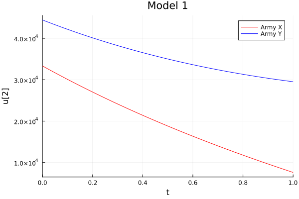
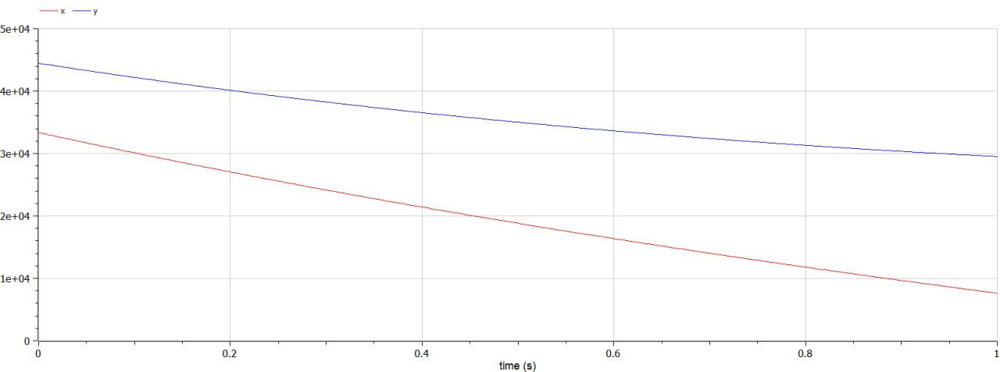
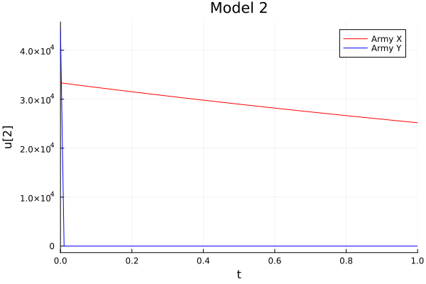
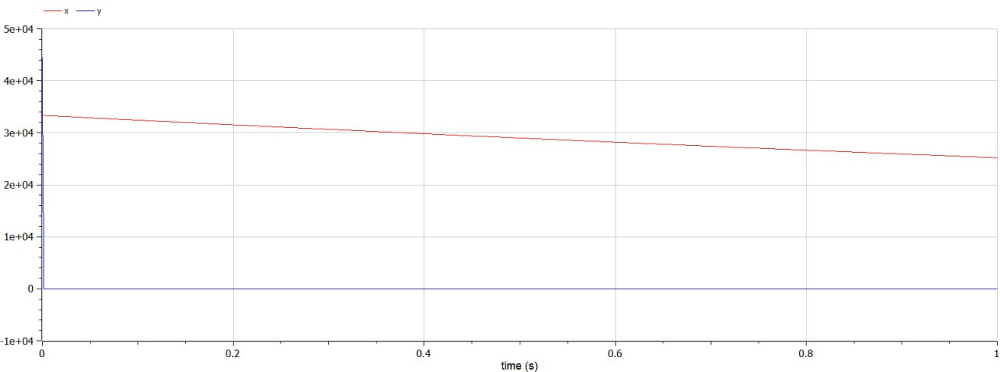

---
## Front matter
lang: ru-RU
title: Лабораторная работа №3.
subtitle: Модель боевых действий
author:
  - Латыпова Диана. НФИбд-02-21
institute:
  - Российский университет дружбы народов имени Патриса Лумумбы, Москва, Россия
date: 24 февраля  2024

## i18n babel
babel-lang: russian
babel-otherlangs: english

## Formatting pdf
toc: false
toc-title: Содержание
slide_level: 2
aspectratio: 169
section-titles: true
theme: metropolis
header-includes:
 - \metroset{progressbar=frametitle,sectionpage=progressbar,numbering=fraction}
 - '\makeatletter'
 - '\beamer@ignorenonframefalse'
 - '\makeatother'
---

# Информация

## Докладчик

:::::::::::::: {.columns align=center}
::: {.column width="70%"}

  * Латыпова Диана
  * студент группы НФИбд-02-21
  * Российский университет дружбы народов имени Патриса Лумумбы
  * [1033215005@rudn.ru](mailto:1032215005@rudn.ru)
  * <https://github.com/dlatypova>

:::
::: {.column width="30%"}

:::
::::::::::::::

## Цели

- Рассмотреть некоторые простейшие модели боевых действий - модели Ланчестера.
- Рассмотреть случаи ведения боевых действий. 
- Реализовать модель на языке программирования Julia. 
- Реализовать модель в программе Open Modelica.

## Задача

Между страной Х и страной У идет война. Численность состава войск исчисляется от начала войны, и являются временными функциями $x(t)$ и $y(t)$. В
начальный момент времени страна Х имеет армию численностью $33 333$ человек, а в распоряжении страны У армия численностью в $44 444$ человек. Для упрощения модели считаем, что коэффициенты $a$, $b$, $c$, $h$ постоянны. Также считаем $P(t)$ и $Q(t)$ непрерывными функциями. 

Постройте графики изменения численности войск армии Х и армии У для следующих случаев:

1. Модель боевых действий между регулярными войсками:

$$ {dx\over {dt}} = -0.15x(t)-0.64y(t)+|sin(t+15)| $$
$$ {dy\over {dt}} = -0.55x(t)-0.12y(t)+|cos(t+25
)| $$

2. Модель ведение боевых действий с участием регулярных войск и партизанских отрядов:

$$ {dx\over {dt}} = -0.28x(t)-0.745y(t)+|2sin(3t)| $$
$$ {dy\over {dt}} = -0.613x(t)y(t)-0.35y(t)+|1.5cos(2t)| $$

# Теоретическая справка

## Теоретическая справка

*Законы Ланчестера* - это набор эмпирических закономерностей, разработанных английским инженером Фредериком Ланчестером в начале 20-го века. Эти законы представляют собой математические модели, используемые для анализа военных конфликтов и прогнозирования результатов сражений на основе различных параметров, таких как численность войск, их организация, эффективность оружия и тактические стратегии.
Андрей Осипов (российский ученый) доработал и расширил исходные идеи Ланчестера, предложив свои собственные модели и методы анализа военных конфликтов. Его работы привнесли новые аспекты в понимание динамики сражений и расширили применение законов Ланчестера на практике.

## Теоретическая справка

Важными концепциями в рамках законов Ланчестера являются коэффициенты эффективности и экспоненты силы. Коэффициенты эффективности представляют собой числовые значения, отражающие относительную эффективность каждой стороны в бою, в то время как экспоненты силы отражают, насколько быстро меняется эффективность каждой стороны с увеличением численности.

В контексте законов Ланчестера обычно рассматриваются три основных случая ведения боевых действий:

- Симметричный случай: В этом случае обе стороны обладают примерно одинаковой численностью и эффективностью.
- Асимметричный случай с преимуществом: В этом случае одна из сторон имеет явное преимущество по численности или эффективности вооружения.
- Асимметричный случай без преимущества: В этом случае одна сторона имеет преимущество, но оно не настолько значительно, чтобы гарантировать победу.

## OpenModelica

*OpenModelica* - это свободно распространяемая среда для моделирования и симуляции динамических систем, основанная на языке Modelica. Modelica - это язык моделирования, который позволяет описывать сложные физические системы, такие как электромеханические системы, системы управления, тепловые сети и другие, с помощью уравнений и блоков моделирования.

OpenModelica предоставляет пользователю интуитивно понятный графический интерфейс, который позволяет создавать, редактировать и анализировать модели систем, а также проводить численное решение и симуляцию этих моделей.

# Выполнение лабораторной работы

## Выполнение лабораторной работы

В ходе войны численность армий стран $X$ и $Y$ изменяется под воздействием различных факторов, таких как потери в боях, мобилизация резервов, подкрепление и другие. Для упрощения анализа используются дифференциальные уравнения, описывающие динамику изменения численности вооруженных сил во времени.

## 1 случай

Модель боевых действий между регулярными войсками:

$$ {dx\over {dt}} = -0.15x(t)-0.64y(t)+|sin(t+15)| $$
$$ {dy\over {dt}} = -0.55x(t)-0.12y(t)+|cos(t+25
)| $$

Эта модель описывает ситуацию, когда конфликт ведется только между регулярными вооруженными силами обеих стран. Уравнение представляет изменение численности армии страны $X$ во времени, учитывая потери в результате боевых действий с армией страны $Y$ и случайные факторы, представленные синусоидальной функцией. Второе уравнение аналогично описывает изменение численности армии страны $Y$, учитывая потери в сражениях с армией страны $X$ и случайные факторы.

## 1 случай

Случай 1 (Julia)(рис. [-@fig:001]):

{#fig:001 width=40%}

## 1 случай

Случай 1 (OpenModelica)(рис. [-@fig:002]):

{#fig:002 width=40%}

## 2 случай

Модель ведения боевых действий с участием регулярных войск и партизанских отрядов:

$$ {dx\over {dt}} = -0.28x(t)-0.745y(t)+|2sin(3t)| $$
$$ {dy\over {dt}} = -0.613x(t)y(t)-0.35y(t)+|1.5cos(2t)| $$

Эта модель дополнительно учитывает присутствие партизанских отрядов военной оппозиции. Уравнение описывает изменение численности армии страны $X$, учитывая как потери в боях с армией страны $Y$, так и воздействие партизанских действий, представленных синусоидальной функцией. Второе уравнение описывает изменение численности армии страны $Y$, учитывая как потери от регулярных боевых действий с армией страны $X$, так и воздействие партизанских действий, представленных косинусоидальной функцией.

## 2 случай

Случай 2 (Julia)(рис. [-@fig:003]):

{#fig:003 width=40%}

## 2 случай

Случай 2 (OpenModelica)(рис. [-@fig:004]):

{#fig:004 width=40%}

# Выводы

## Выводы

Я рассмотрела некоторые простейшие модели боевых действий - модели Ланчестера и случаи ведения боевых действий. Также реализовала модель на языке программирования Julia. Познакомилась с программой  OpenModelica и реализовала модель в программе Open Modelica.

