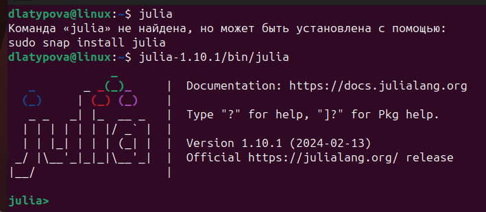
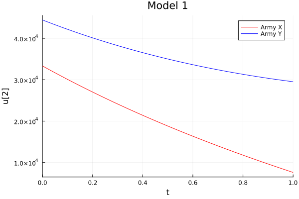
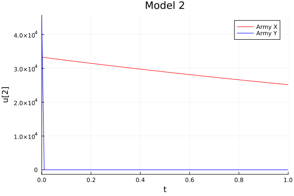
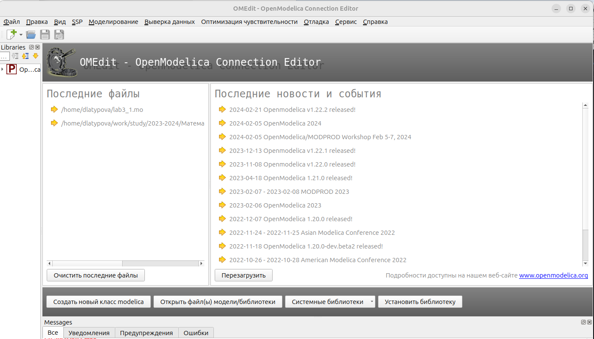
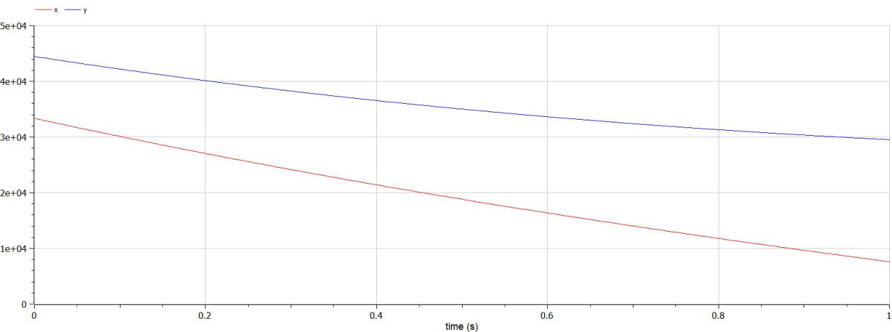
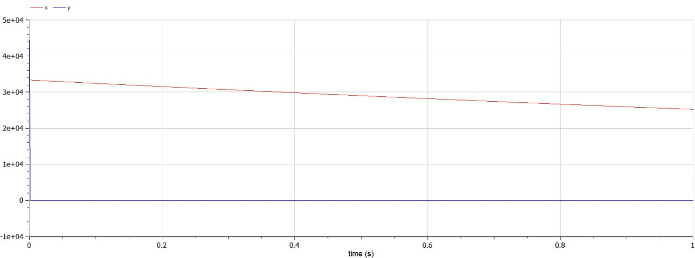

---
## Front matter
title: "Лабораторная работа №3"
subtitle: "Модель боевых действий"
author: "Латыпова Диана. НФИбд-02-21"

## Generic otions
lang: ru-RU
toc-title: "Содержание"

## Bibliography
bibliography: bib/cite.bib
csl: pandoc/csl/gost-r-7-0-5-2008-numeric.csl

## Pdf output format
toc: true # Table of contents
toc-depth: 2
lof: true # List of figures
lot: true # List of tables
fontsize: 12pt
linestretch: 1.5
papersize: a4
documentclass: scrreprt
## I18n polyglossia
polyglossia-lang:
  name: russian
  options:
	- spelling=modern
	- babelshorthands=true
polyglossia-otherlangs:
  name: english
## I18n babel
babel-lang: russian
babel-otherlangs: english
## Fonts
mainfont: PT Serif
romanfont: PT Serif
sansfont: PT Sans
monofont: PT Mono
mainfontoptions: Ligatures=TeX
romanfontoptions: Ligatures=TeX
sansfontoptions: Ligatures=TeX,Scale=MatchLowercase
monofontoptions: Scale=MatchLowercase,Scale=0.9
## Biblatex
biblatex: true
biblio-style: "gost-numeric"
biblatexoptions:
  - parentracker=true
  - backend=biber
  - hyperref=auto
  - language=auto
  - autolang=other*
  - citestyle=gost-numeric
## Pandoc-crossref LaTeX customization
figureTitle: "Рис."
tableTitle: "Таблица"
listingTitle: "Листинг"
lofTitle: "Список иллюстраций"
lotTitle: "Список таблиц"
lolTitle: "Листинги"
## Misc options
indent: true
header-includes:
  - \usepackage{indentfirst}
  - \usepackage{float} # keep figures where there are in the text
  - \floatplacement{figure}{H} # keep figures where there are in the text
---

# Цель работы

Рассмотреть некоторые простейшие модели боевых действий - модели Ланчестера.Рассмотреть случаи ведения боевых действий. Реализовать модель на языке программирования Julia. Реализовать модель в программе Open Modelica.

# Задание

Между страной Х и страной У идет война. Численность состава войск исчисляется от начала войны, и являются временными функциями $x(t)$ и $y(t)$. В
начальный момент времени страна Х имеет армию численностью $33 333$ человек, а в распоряжении страны У армия численностью в $44 444$ человек. Для упрощения модели считаем, что коэффициенты $a$, $b$, $c$, $h$ постоянны. Также считаем $P(t)$ и $Q(t)$ непрерывными функциями. 

Постройте графики изменения численности войск армии Х и армии У для следующих случаев:

1. Модель боевых действий между регулярными войсками:

$$ {dx\over {dt}} = -0.15x(t)-0.64y(t)+|sin(t+15)| $$
$$ {dy\over {dt}} = -0.55x(t)-0.12y(t)+|cos(t+25
)| $$

2. Модель ведение боевых действий с участием регулярных войск и партизанских отрядов:

$$ {dx\over {dt}} = -0.28x(t)-0.745y(t)+|2sin(3t)| $$
$$ {dy\over {dt}} = -0.613x(t)y(t)-0.35y(t)+|1.5cos(2t)| $$

# Теоретическое введение

*Законы Ланчестера* - это набор эмпирических закономерностей, разработанных английским инженером Фредериком Ланчестером в начале 20-го века. Эти законы представляют собой математические модели, используемые для анализа военных конфликтов и прогнозирования результатов сражений на основе различных параметров, таких как численность войск, их организация, эффективность оружия и тактические стратегии [@wiki:bash].
Андрей Осипов (российский ученый) доработал и расширил исходные идеи Ланчестера, предложив свои собственные модели и методы анализа военных конфликтов. Его работы привнесли новые аспекты в понимание динамики сражений и расширили применение законов Ланчестера на практике.

Основная идея законов Ланчестера состоит в том, что результаты битвы зависят не только от общего числа воюющих сторон, но и от их относительной силы. По сути, эти законы пытаются выразить математические зависимости между численностью и организацией вооруженных сил и исходом боевых действий.

Важными концепциями в рамках законов Ланчестера являются коэффициенты эффективности и экспоненты силы. Коэффициенты эффективности представляют собой числовые значения, отражающие относительную эффективность каждой стороны в бою, в то время как экспоненты силы отражают, насколько быстро меняется эффективность каждой стороны с увеличением численности.

В контексте законов Ланчестера обычно рассматриваются три основных случая ведения боевых действий:

- Симметричный случай: В этом случае обе стороны обладают примерно одинаковой численностью и эффективностью.
- Асимметричный случай с преимуществом: В этом случае одна из сторон имеет явное преимущество по численности или эффективности вооружения.
- Асимметричный случай без преимущества: В этом случае одна сторона имеет преимущество, но оно не настолько значительно, чтобы гарантировать победу.

*OpenModelica* - это свободно распространяемая среда для моделирования и симуляции динамических систем, основанная на языке Modelica. Modelica - это язык моделирования, который позволяет описывать сложные физические системы, такие как электромеханические системы, системы управления, тепловые сети и другие, с помощью уравнений и блоков моделирования.

OpenModelica предоставляет пользователю интуитивно понятный графический интерфейс, который позволяет создавать, редактировать и анализировать модели систем, а также проводить численное решение и симуляцию этих моделей.

Установка Open Modelica на Linux[@installing:bash]:

```
sudo apt-get update
sudo apt-get install ca-certificates curl gnupg
sudo curl -fsSL http://build.openmodelica.org/apt/openmodelica.asc | \
  sudo gpg --dearmor -o /usr/share/keyrings/openmodelica-keyring.gpg
```
Обновите свой файл sources.list, используя следующие строки. Выберите архитектуру вашего процессора, операционную систему и предпочтительную ветку релиза для отслеживания. Установите Open Modelica:

```
echo "deb [arch=amd64 signed-by=/usr/share/keyrings/openmodelica-keyring.gpg] \
  https://build.openmodelica.org/apt \
  $(cat /etc/os-release | grep "\(UBUNTU\\|DEBIAN\\|VERSION\)_CODENAME" | sort | cut -d= -f 2 | head -1) \
  stable" | sudo tee /etc/apt/sources.list.d/openmodelica.list
sudo apt update
sudo apt install openmodelica
```

# Выполнение лабораторной работы

В ходе войны численность армий стран $X$ и $Y$ изменяется под воздействием различных факторов, таких как потери в боях, мобилизация резервов, подкрепление и другие. Для упрощения анализа используются дифференциальные уравнения, описывающие динамику изменения численности вооруженных сил во времени.

Модель боевых действий между регулярными войсками:

$$ {dx\over {dt}} = -0.15x(t)-0.64y(t)+|sin(t+15)| $$
$$ {dy\over {dt}} = -0.55x(t)-0.12y(t)+|cos(t+25
)| $$

Эта модель описывает ситуацию, когда конфликт ведется только между регулярными вооруженными силами обеих стран. Уравнение представляет изменение численности армии страны $X$ во времени, учитывая потери в результате боевых действий с армией страны $Y$ и случайные факторы, представленные синусоидальной функцией. Второе уравнение аналогично описывает изменение численности армии страны $Y$, учитывая потери в сражениях с армией страны $X$ и случайные факторы.

Модель ведения боевых действий с участием регулярных войск и партизанских отрядов:

$$ {dx\over {dt}} = -0.28x(t)-0.745y(t)+|2sin(3t)| $$
$$ {dy\over {dt}} = -0.613x(t)y(t)-0.35y(t)+|1.5cos(2t)| $$

Эта модель дополнительно учитывает присутствие партизанских отрядов военной оппозиции. Уравнение описывает изменение численности армии страны $X$, учитывая как потери в боях с армией страны $Y$, так и воздействие партизанских действий, представленных синусоидальной функцией. Второе уравнение описывает изменение численности армии страны $Y$, учитывая как потери от регулярных боевых действий с армией страны $X$, так и воздействие партизанских действий, представленных косинусоидальной функцией.

Далее я написала код на языкке программирования Julia:

```
# Необходимые модули
using Plots
using DifferentialEquations

# Начальная численность армий
const initial_x = 33333
const initial_y = 44444
initial_point = [initial_x, initial_y]
# Определяем временной интервал
time_interval = [0.0, 5.0] 

# Константы для первой модели
a1 = 0.15
b1 = 0.64
c1 = 0.55
h1 = 0.12
# Константы для второй модели
a2 = 0.28
b2 = 0.745
c2 = 0.613
h2 = 0.35

# Функции, описывающие возможность подкрепления
# Для первой модели
function reinforcement_x1(t)
    return abs(sin(t+15))
end

function reinforcement_y1(t)
    return abs(cos(t+25))
end

# Для второй модели
function reinforcement_x2(t)
    return abs(2*sin(3t))
end

function reinforcement_y2(t)
    return abs(1.5*cos(2t))
end

# Система уравнений для первой модели
function model1!(dp, point, p, t)
    dp[1] = -a1*point[1] - b1*point[2] + reinforcement_x1(t)
    dp[2] = -c1*point[1] - h1*point[2] + reinforcement_y1(t)
end

# Система уравнений для второй модели
function model2!(dp, point, p, t)
    dp[1] = -a2*point[1] - b2*point[2] + reinforcement_x2(t)
    dp[2] = -c2*point[1]*point[2] - h2*point[2] + reinforcement_y2(t)
end

# Создаем массив времени для отслеживания изменений
t = collect(LinRange(0, 1, 100))

# Решаем уравнения для первой модели
problem1 = ODEProblem(model1!, initial_point, time_interval)
solution1 = solve(problem1, saveat=t)

# Решаем уравнения для второй модели
problem2 = ODEProblem(model2!, initial_point, time_interval)
solution2 = solve(problem2, saveat=t)

# Построение графиков
# Первая модель
plot1 = plot(
    solution1, 
    vars=(0, 1), 
    color=:red,
    label="Army X",
    title="Model 1",
    xlabel="Time",
    ylabel="Number of Troops"
)

plot!(
    solution1,
    vars=(0, 2),
    color=:blue,
    label="Army Y"
)

savefig(plot1, "model1.png")

# Вторая модель
plot2 = plot(
    solution2, 
    vars=(0, 1), 
    color=:red,
    label="Army X",
    title="Model 2",
    xlabel="Time",
    ylabel="Number of Troops"
)

plot!(
    solution2,
    vars=(0, 2),
    color=:blue,
    label="Army Y"
)

savefig(plot2, "model2.png")

```
Запустили Julia в терминале(рис. [-@fig:001]):

{#fig:001 width=70%}

Сгенрерировалось 2 графика:

- 1 слуйчай: Модель боевых действий между регулярными войсками на языке Julia (рис. [-@fig:002]):

{#fig:002 width=70%}

- 2 случай: Модель ведение боевых действий с участием регулярных войск и партизанских отрядов на языке Julia (рис. [-@fig:003]):

{#fig:003 width=70%}

Запустили программу OpenModelica (рис. [-@fig:004])

{#fig:004 width=70%}

Написали код:

- для 1 случая:

```
model lab3_1 
Real x;
Real y;
Real t = time;
initial equation
x = 33333;
y = 44444;
equation
der(x) = -0.15*x - 0.64*y + abs(sin(t+15));
der(y) = -0.55*x - 0.12*y + abs(cos(t+25));
end lab3_1;
```
Имеем соответствующий график(рис. [-@fig:005])

{#fig:005 width=70%}


- для 2 случая:

```
model lab3_2 
Real x;
Real y;
Real t = time;
initial equation
x = 33333;
y = 44444;
equation
der(x) = -0.28*x - 0.745*y + abs(2*sin(3*t));
der(y) = -0.613*x*y - 0.35*y + abs(1.5*cos(2*t));
end lab3_2;
```

Имеем соответствующий график(рис. [-@fig:006])

{#fig:006 width=70%}

Проанализировав сгенерированные графики на языке Julia и в программе OpenModelica, мы можем видеть, что графики идентичны. Что говорит о верном выполнении нашего задания.

# Выводы

Я рассмотрела некоторые простейшие модели боевых действий - модели Ланчестера и случаи ведения боевых действий. Также реализовала модель на языке программирования Julia. Познакомилась с программой  OpenModelica и реализовала модель в программе Open Modelica.

# Список литературы{.unnumbered}

::: {#refs}
:::
