---
## Front matter
lang: ru-RU
title: Лабораторная работа №4.
subtitle: Модель гармонического осциллятора
author:
  - Латыпова Диана. НФИбд-02-21
institute:
  - Российский университет дружбы народов имени Париса Лумумбы, Москва, Россия
date: 2024

## i18n babel
babel-lang: russian
babel-otherlangs: english

## Formatting pdf
toc: false
toc-title: Содержание
slide_level: 2
aspectratio: 169
section-titles: true
theme: metropolis
header-includes:
 - \metroset{progressbar=frametitle,sectionpage=progressbar,numbering=fraction}
 - '\makeatletter'
 - '\beamer@ignorenonframefalse'
 - '\makeatother'
---

# Информация

## Докладчик

:::::::::::::: {.columns align=center}
::: {.column width="70%"}

  * Латыпова Диана
  * студент группы НФИбд-02-21
  * Российский университет дружбы народов имени патриса Лумумбы
  * [1032215005@rudn.ru](mailto:1032215005@rudn.ru)
  * <https://github.com/dlatypova>

:::
::: {.column width="30%"}

:::
::::::::::::::

# Вводная часть

## Цели и задачи

- Изучить понятие гармонического осциллятора;
- Построить фазовый портрет гармонического осциллятора;
- Решить уравнение гармонического осциллятора для трех случаев.

## Задание

Вариант 46.

Постройте фазовый портрет гармонического осциллятора и решение уравнения гармонического осциллятора для следующих случаев:

1. Колебания гармонического осциллятора без затуханий и без действий внешней силы $\ddot{x}+8.8x=0$;
2. Колебания гармонического осциллятора c затуханием и без действий внешней силы $\ddot{x}+7.7\dot{x}+3.3x=0$
3. Колебания гармонического осциллятора c затуханием и под действием внешней силы $\ddot{x}+4.4\dot{x}+5.5x=2.2sin(4t)$

На интервале $t\in [0;55]$ (шаг $0.05$) с начальными условиями $x_0=1.1, y_0=0$.

# Теоретическая часть

## Гармоническиц осциллятор

**Гармонический осциллятор** - это система, которая обладает возвращающей силой, пропорциональной смещению от положения равновесия, и инерционной массой.

Математически гармонический осциллятор описывается дифференциальным уравнением второго порядка:

$m\ddot{x}+c\dot{x}+kx=F(t)$

$m$ - масса, $c$ - коэффициент затухания(если присутствует), $k$ - коэффициент упругости, $F(t)$ - внешняя сила (если присутствует).

## Гармоническиц осциллятор

В случае отсутствия внешних сил и затухания уравнение принимает простой вид:

$m\ddot{x}+kx=0$

Решение уравнений гармонического осциллятора позволяет предсказать поведение системы во времени, а фазовые портреты дают графическое представление этого поведения в фазовом пространстве.

## Фазовый портрет

**Фазовый портрет** - это графическое представление решения дифференциального уравнения в плоскости $(x, \dot x)$, где $x$ - смещение, а $\dot x$- скорость изменения смещения 

# Рассмотрим каждый случай

# 1 случай

*Колебания гармонического осциллятора без затуханий и без действий внешней силы:*

Уравнение данного случая: $\ddot{x}+8.8x=0$;

В данном уравнении коэффициент перед $x$ соответствует жесткости $k$ гармонического осциллятора, а так как отсутствуют члены с $\dot x$ и $F(t)$, это означает, что отсутствуют как затухающие силы, так и внешние воздействия.

# 1 случай на языке Julia

График (рис. [-@fig:001]):

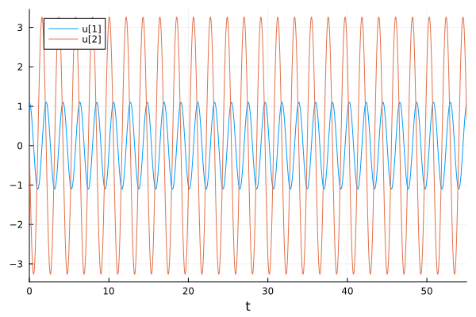{#fig:001 width=50%}

# 1 случай на языке Julia

Фазовый портрет (рис. [-@fig:002]):

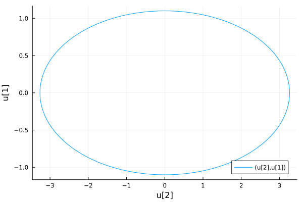{#fig:002 width=50%}

# 1 случай на ПО OpenModelica

График (рис. [-@fig:003]):

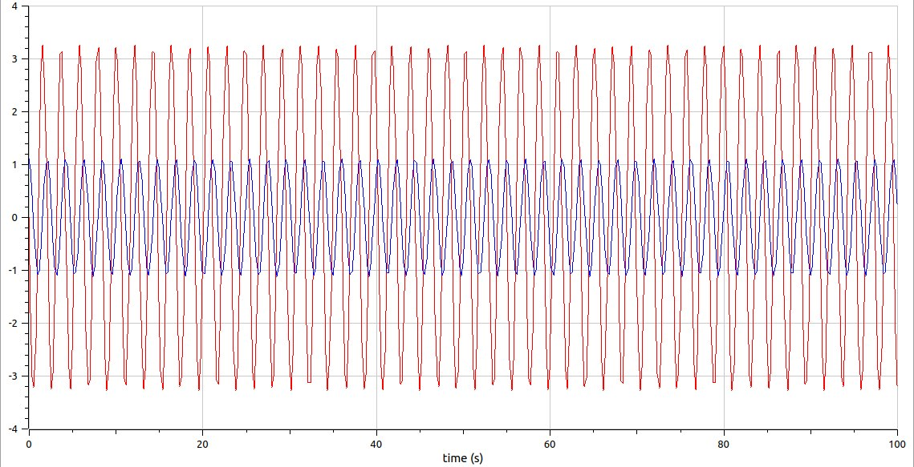{#fig:003 width=50%}

# 1 случай на языке OpenModelica

Фазовый портрет (рис. [-@fig:004]):

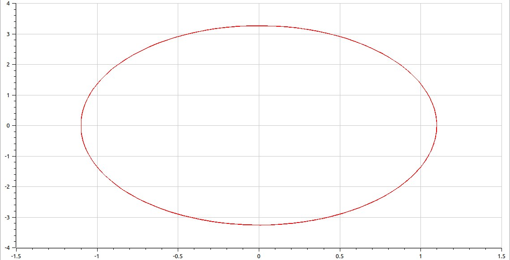{#fig:004 width=50%}

# 2 случай

*Колебания гармонического осциллятора c затуханием и без действий внешней силы:* 

$\ddot{x}+7.7\dot{x}+3.3x=0$

В этом уравнении, помимо члена с $x$, есть члены с $\dot x$ и без него. Член с $\dot x$ соответствует силе затухания, которая пропорциональна скорости изменения смещения. Внешняя сила отсутствует $(F(t)=0)$.

# 2 случай на языке Julia

График (рис. [-@fig:005]):

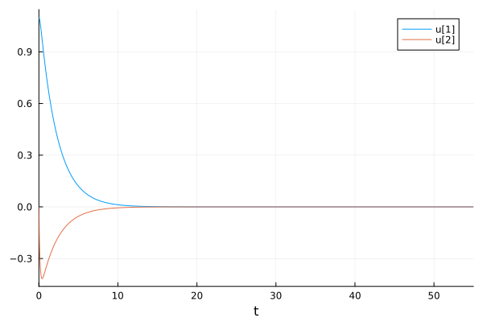{#fig:005 width=50%}

# 2 случай на языке Julia

Фазовый портрет (рис. [-@fig:006]):

{#fig:006 width=50%}

# 2 случай на ПО OpenModelica

График (рис. [-@fig:007]):

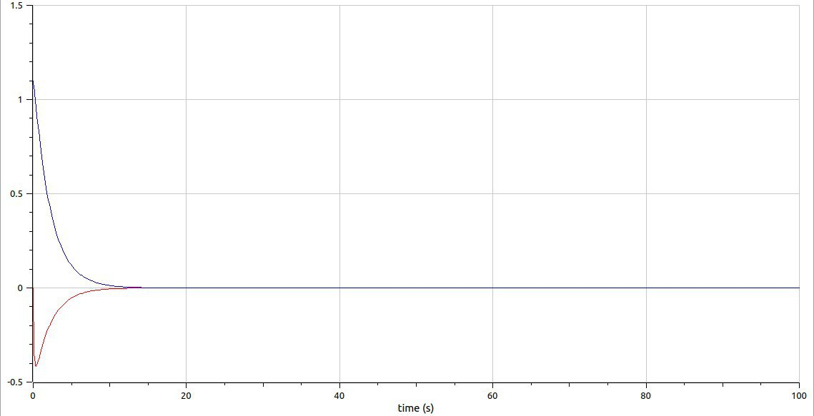{#fig:007 width=50%}

# 2 случай на языке OpenModelica

Фазовый портрет (рис. [-@fig:008]):

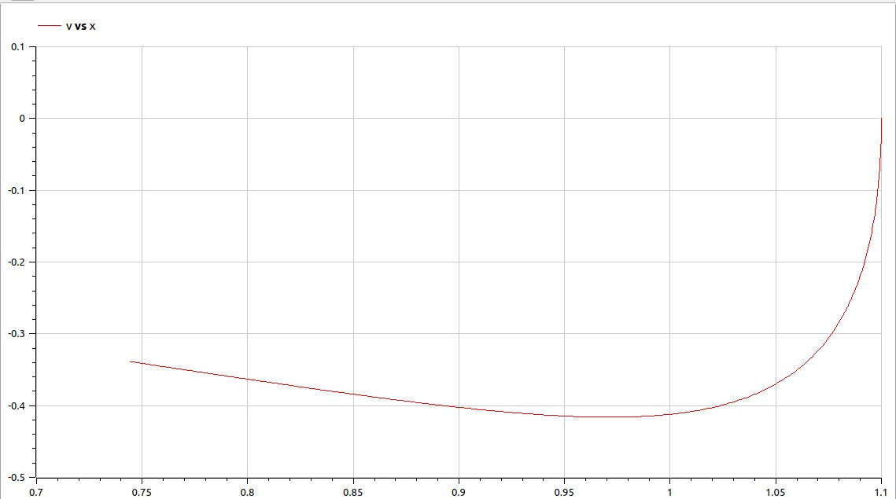{#fig:008 width=50%}

# 3 случай

*Колебания гармонического осциллятора c затуханием и под действием внешней силы:*

$\ddot{x}+4.4\dot{x}+5.5x=2.2sin(4t)$

В этом уравнении, помимо члена с $x$ и члена с $\dot x$, есть член, соответствующий внешней силе $F(t)$, которая является синусоидальной функцией.

# 3 случай на языке Julia

График (рис. [-@fig:009]):

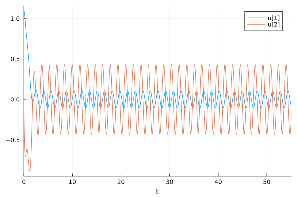

# 3 случай на языке Julia

Фазовый портрет (рис. [-@fig:010]):

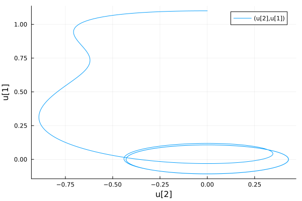{#fig:010 width=50%}

# 3 случай на ПО OpenModelica

График (рис. [-@fig:011]):

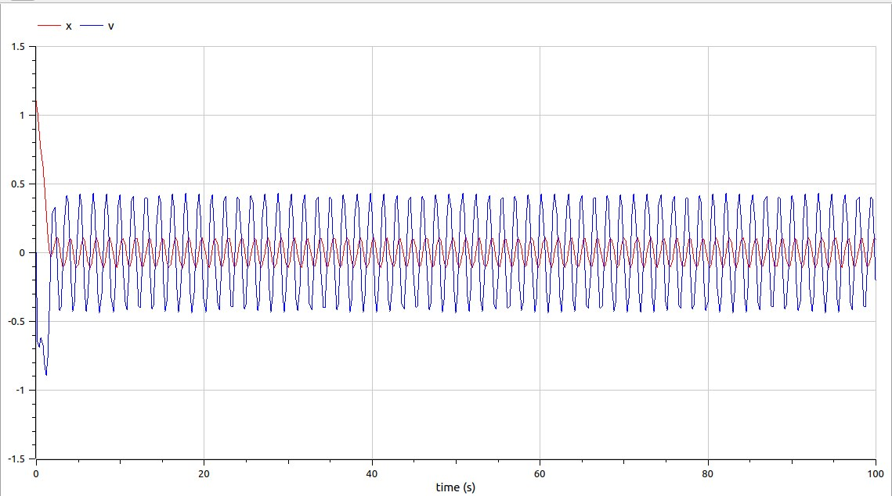{#fig:011 width=50%}

# 3 случай на языке OpenModelica

Фазовый портрет (рис. [-@fig:012]):

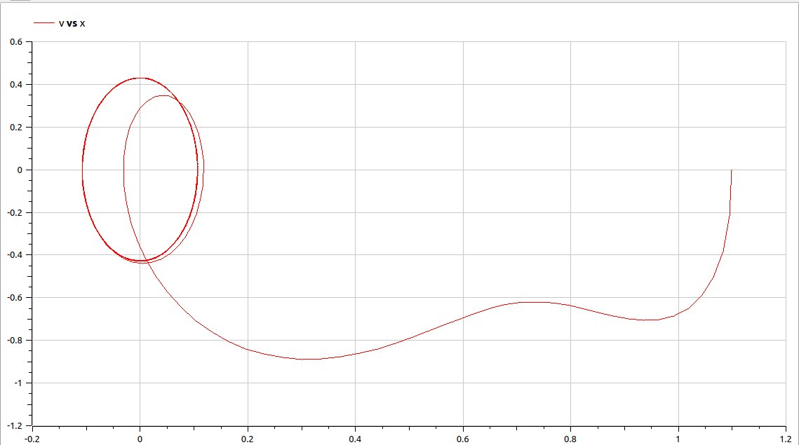{#fig:012 width=50%}

# Обший анализ

Построив графики и фазовые портреты 3 случаев, можем заметить, что код для ПО OpenModelica значительно меньше. И, кстати, говоря у меня фазовые портреты получились отзеркаленными.

# Выводы

Я изучула понятие гармонического осциллятора и фазовых портретов. Реализовала графики и фазовые портреты гармонического осциллятора для 3 случаев на языке программирования Julia и на ПО OpenModelica. А также решила уравнение гармонического осциллятора для трех случаев.

