---
## Front matter
title: "Лабораторная работа №4"
subtitle: "Модель гармонического осциллятора"
author: "Латыпова Диана. НФИбд-02-21"

## Generic otions
lang: ru-RU
toc-title: "Содержание"

## Bibliography
bibliography: bib/cite.bib
csl: pandoc/csl/gost-r-7-0-5-2008-numeric.csl

## Pdf output format
toc: true # Table of contents
toc-depth: 2
lof: true # List of figures
lot: true # List of tables
fontsize: 12pt
linestretch: 1.5
papersize: a4
documentclass: scrreprt
## I18n polyglossia
polyglossia-lang:
  name: russian
  options:
	- spelling=modern
	- babelshorthands=true
polyglossia-otherlangs:
  name: english
## I18n babel
babel-lang: russian
babel-otherlangs: english
## Fonts
mainfont: PT Serif
romanfont: PT Serif
sansfont: PT Sans
monofont: PT Mono
mainfontoptions: Ligatures=TeX
romanfontoptions: Ligatures=TeX
sansfontoptions: Ligatures=TeX,Scale=MatchLowercase
monofontoptions: Scale=MatchLowercase,Scale=0.9
## Biblatex
biblatex: true
biblio-style: "gost-numeric"
biblatexoptions:
  - parentracker=true
  - backend=biber
  - hyperref=auto
  - language=auto
  - autolang=other*
  - citestyle=gost-numeric
## Pandoc-crossref LaTeX customization
figureTitle: "Рис."
tableTitle: "Таблица"
listingTitle: "Листинг"
lofTitle: "Список иллюстраций"
lotTitle: "Список таблиц"
lolTitle: "Листинги"
## Misc options
indent: true
header-includes:
  - \usepackage{indentfirst}
  - \usepackage{float} # keep figures where there are in the text
  - \floatplacement{figure}{H} # keep figures where there are in the text
---

# Цель работы

- Изучить понятие гармонического осциллятора;
- Построить фазовый портрет гармонического осциллятора;
- Решить уравнение гармонического осциллятора для трех случаев.

# Задание

Вариант 46.

Постройте фазовый портрет гармонического осциллятора и решение уравнения гармонического осциллятора для следующих случаев:

1. Колебания гармонического осциллятора без затуханий и без действий внешней силы $\ddot{x}+8.8x=0$;
2. Колебания гармонического осциллятора c затуханием и без действий внешней силы $\ddot{x}+7.7\dot{x}+3.3x=0$
3. Колебания гармонического осциллятора c затуханием и под действием внешней силы $\ddot{x}+4.4\dot{x}+5.5x=2.2sin(4t)$

На интервале $t\in [0;55]$ (шаг $0.05$) с начальными условиями $x_0=1.1, y_0=0$.

# Теоретическое введение

**Гармонический осциллятор** - это система, которая обладает возвращающей силой, пропорциональной смещению от положения равновесия, и инерционной массой [@wiki:bash].

Математически гармонический осциллятор описывается дифференциальным уравнением второго порядка:

$m\ddot{x}+c\dot{x}+kx=F(t)$

$m$ - масса, $c$ - коэффициент затухания(если присутствует), $k$ - коэффициент упругости, $F(t)$ - внешняя сила (если присутствует).

В случае отсутствия внешних сил и затухания уравнение принимает простой вид:

$m\ddot{x}+kx=0$

Это уравнение описывает свободные колебания гармонического осциллятора.

Гармонические осцилляторы широко встречаются в физике: начиная от малых механических систем, таких как маятники и пружинные массы, до электрических контуров в радиотехнике и атомных систем, таких как электроны, движущиеся вокруг ядра атома.

Решение уравнений гармонического осциллятора позволяет предсказать поведение системы во времени, а фазовые портреты дают графическое представление этого поведения в фазовом пространстве.

**Фазовый портрет** - это графическое представление решения дифференциального уравнения в плоскости $(x, \dot x)$, где $x$ - смещение, а $\dot x$- скорость изменения смещения [@habr:bash].

# Выполнение лабораторной работы

Рассмотрим каждый случай:

1. *Колебания гармонического осциллятора без затуханий и без действий внешней силы:*

Уравнение данного случая: $\ddot{x}+8.8x=0$;

В данном уравнении коэффициент перед $x$ соответствует жесткости $k$ гармонического осциллятора, а так как отсутствуют члены с $\dot x$ и $F(t)$, это означает, что отсутствуют как затухающие силы, так и внешние воздействия.

Код на языке Julia (рис. [-@fig:001]) (рис. [-@fig:002]):

```
using DifferentialEquations

# Функция, описывающая правую часть уравнения гармонического осциллятора
function harmonic_oscillator!(du, u, p, t)
    k = p  # Коэффициент жесткости гармонического осциллятора
    du[1] = u[2]  # dx/dt = y
    du[2] = -k * u[1]  # dy/dt = -kx
end

# Начальные условия: смещение и скорость
const initial_displacement = 1.1
const initial_velocity = 0.0
u0 = [initial_displacement, initial_velocity]

p = (8.8)  # Коэффициент жесткости гармонического осциллятора
tspan = (0.0, 55.0)  # Временной интервал
problem = ODEProblem(harmonic_oscillator!, u0, tspan, p)  # Определение задачи для решения ОДУ
solution = solve(problem, dtmax=0.05)  # Решение задачи с заданным максимальным шагом по времени

using Plots
gr()

# Построение решения системы уравнений (графики смещения и скорости от времени)
plot(solution)
savefig("julia4_1.png")  # Сохранение графика решения в файл

# Построение фазового портрета (график скорости от смещения)
plot(solution, vars=(2,1))
savefig("julia4_1phase.png")  # Сохранение фазового портрета в файл

```

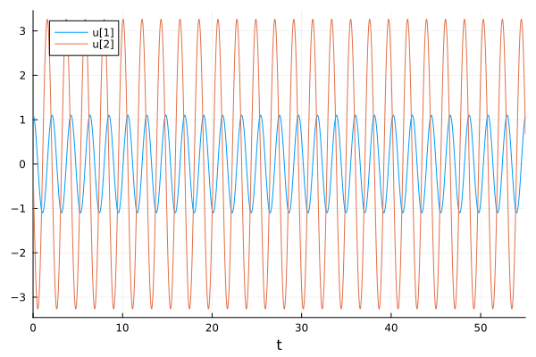{#fig:001 width=70%}

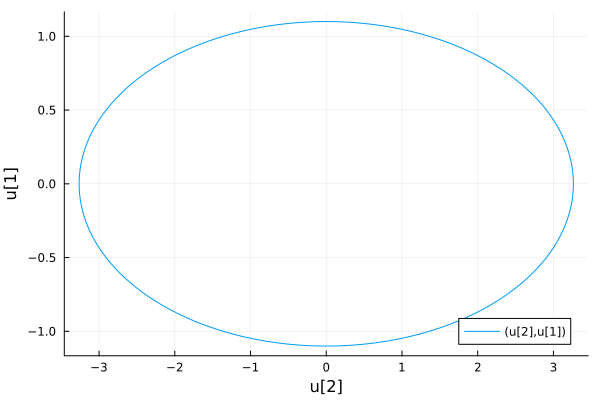{#fig:002 width=70%}

Код для ПО OpenModelica (рис. [-@fig:003]) (рис. [-@fig:004]):

```
model lab4_1 

parameter Real x0 = 1.1; 
parameter Real y0 = 0.0; 

  // Объявление переменных модели
  Real x(start=x0);
  Real v(start=y0);
  
  // Уравнение движения гармонического осциллятора
  equation
    der(x) = y;
    der(y) = -8.8 * x;


end lab4_1;
```

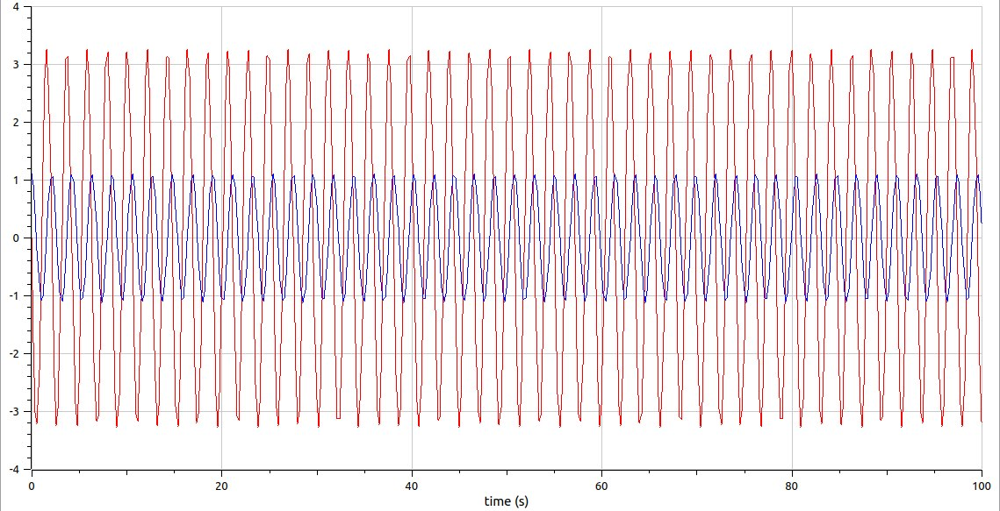{#fig:003 width=70%}

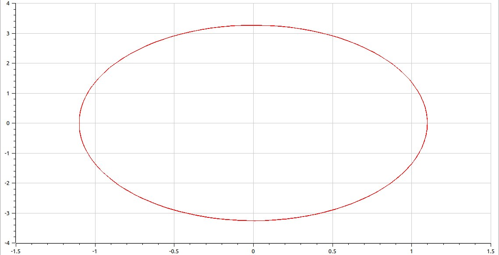{#fig:004 width=70%}


2. *Колебания гармонического осциллятора c затуханием и без действий внешней силы:* 

$\ddot{x}+7.7\dot{x}+3.3x=0$

В этом уравнении, помимо члена с $x$, есть члены с $\dot x$ и без него. Член с $\dot x$ соответствует силе затухания, которая пропорциональна скорости изменения смещения. Внешняя сила отсутствует $(F(t)=0)$.

Код на языке Julia (рис. [-@fig:005]) (рис. [-@fig:006]):

```
using DifferentialEquations

# Функция, описывающая правую часть уравнения гармонического осциллятора
function harmonic_oscillator!(du, u, p, t)
    c, k = p  # Коэффициенты затухания и жесткости гармонического осциллятора
    du[1] = u[2]  # dx/dt = y
    du[2] = -c * du[1] - k * u[1]  # dy/dt = -cx' - kx
end

# Начальные условия: смещение и скорость
const initial_displacement = 1.1
const initial_velocity = 0.0
u0 = [initial_displacement, initial_velocity]

c = 7.7  # Коэффициент затухания гармонического осциллятора
k = 3.3  # Коэффициент жесткости гармонического осциллятора
p = (c, k)  # Параметры системы (коэффициенты затухания и жесткости)
tspan = (0.0, 55.0)  # Временной интервал
problem = ODEProblem(harmonic_oscillator!, u0, tspan, p)  # Определение задачи для решения ОДУ
solution = solve(problem, dtmax=0.05)  # Решение задачи с заданным максимальным шагом по времени

using Plots
gr()

# Построение решения системы уравнений (графики смещения и скорости от времени)
plot(solution)
savefig("julia4_2.png")  # Сохранение графика решения в файл

# Построение фазового портрета (график скорости от смещения)
plot(solution, vars=(2,1))
savefig("julia4_2phase.png")  # Сохранение фазового портрета в файл

```

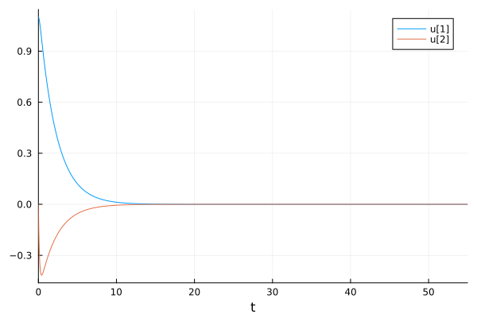{#fig:005 width=70%}

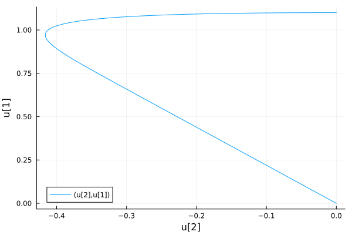{#fig:006 width=70%}

Код для ПО OpenModelica (рис. [-@fig:007]) (рис. [-@fig:008]):

```
model lab4_2

parameter Real x0 = 1.1; 
parameter Real y0 = 0.0; 

  // Объявление переменных модели
  Real x(start=x0);
  Real v(start=y0);

// Уравнение движения гармонического осциллятора с затуханием
equation 
der(x) = y;
der(y) = -7.7 * y - 3.3 * x;

end lab4_2;
```

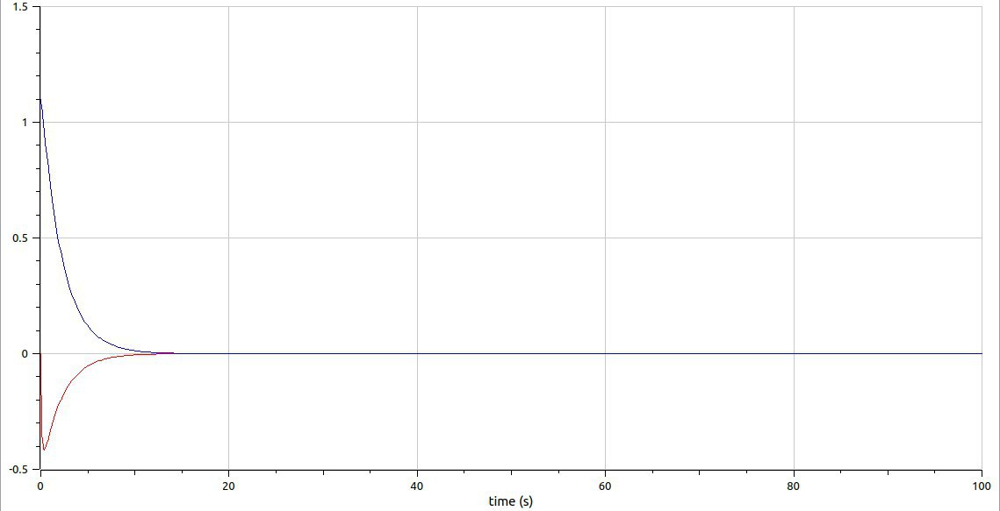{#fig:007 width=70%}

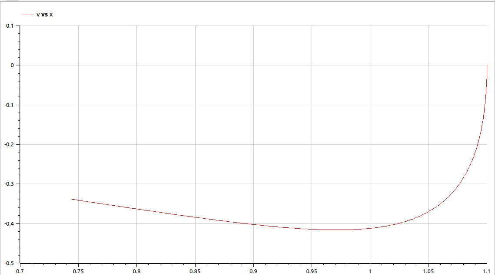{#fig:008 width=70%}


3. *Колебания гармонического осциллятора c затуханием и под действием внешней силы:*

$\ddot{x}+4.4\dot{x}+5.5x=2.2sin(4t)$

В этом уравнении, помимо члена с $x$ и члена с $\dot x$, есть член, соответствующий внешней силе $F(t)$, которая является синусоидальной функцией.

Код на языке Julia (рис. [-@fig:009]) (рис. [-@fig:010]):

```
# x'' + 4.4x' + 5.5x = 2.2sin(4t)
using DifferentialEquations

# Функция, описывающая правую часть уравнения гармонического осциллятора
function harmonic_oscillator!(du, u, p, t)
    c, k = p  # Коэффициенты затухания и жесткости гармонического осциллятора
    du[1] = u[2]  # dx/dt = y
    du[2] = -c * du[1] - k * u[1] + 2.2 * sin(4 * t)  # dy/dt = -cx' - kx + 2.2 * sin(4t)
end

# Начальные условия: смещение и скорость
const initial_displacement = 1.1
const initial_velocity = 0.0
u0 = [initial_displacement, initial_velocity]

c = 4.4  # Коэффициент затухания гармонического осциллятора
k = 5.5  # Коэффициент жесткости гармонического осциллятора
p = (c, k)  # Параметры системы (коэффициенты затухания и жесткости)
tspan = (0.0, 55.0)  # Временной интервал
problem = ODEProblem(harmonic_oscillator!, u0, tspan, p)  # Определение задачи для решения ОДУ
solution = solve(problem, dtmax=0.05)  # Решение задачи с заданным максимальным шагом по времени

using Plots
gr()

# Построение решения системы уравнений (графики смещения и скорости от времени)
plot(solution)
savefig("julia4_3.png")  # Сохранение графика решения в файл

# Построение фазового портрета (график скорости от смещения)
plot(solution, vars=(2,1))
savefig("julia4_3phase.png")  # Сохранение фазового портрета в файл


```

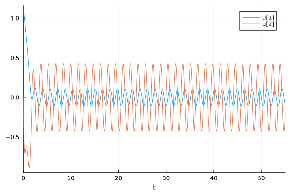{#fig:009 width=70%}

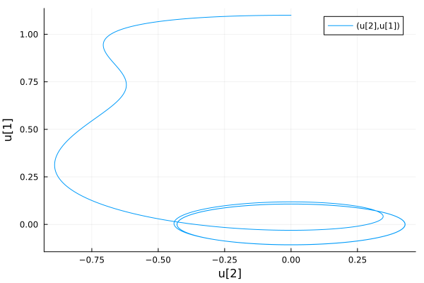{#fig:010 width=70%}

Код для ПО OpenModelica (рис. [-@fig:011]) (рис. [-@fig:012]):

```
model lab4_3

parameter Real x0 = 1.1; 
parameter Real y0 = 0.0; 

  // Объявление переменных модели
  Real x(start=x0);
  Real v(start=y0);

  // Уравнение движения гармонического осциллятора с затуханием и внешней силой
  Real externalForce = 2.2 * sin(4 * time);
  equation
    der(x) = y;
    der(y) = -4.4 * y - 5.5 * x + externalForce;


end lab4_3;
```

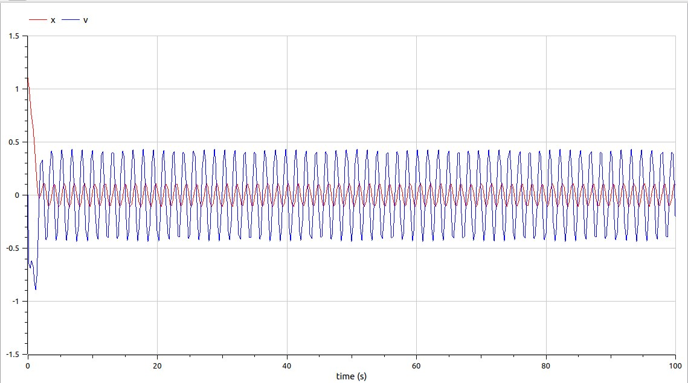{#fig:011 width=70%}

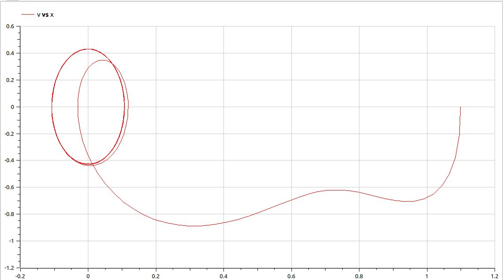{#fig:012 width=70%}

**Общий анализ**: Построив графики и фазовые портреты 3 случаев, можем заметить, что код для ПО OpenModelica значительно меньше. И, кстати, говоря у меня фазовые портреты получились отзеркаленными.


# Выводы

Я изучула понятие гармонического осциллятора и фазовых портретов. Реализовала графики и фазовые портреты гармонического осциллятора для 3 случаев на языке программирования Julia и на ПО OpenModelica. А также решила уравнение гармонического осциллятора для трех случаев.

# Список литературы{.unnumbered}

::: {#refs}
:::
