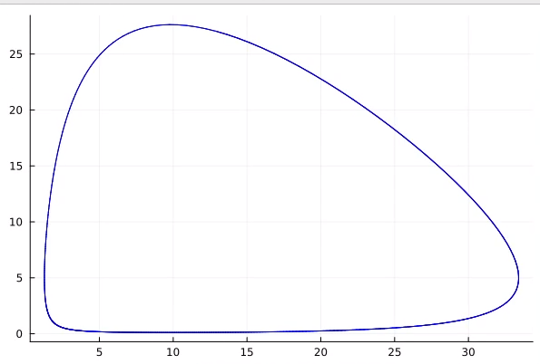
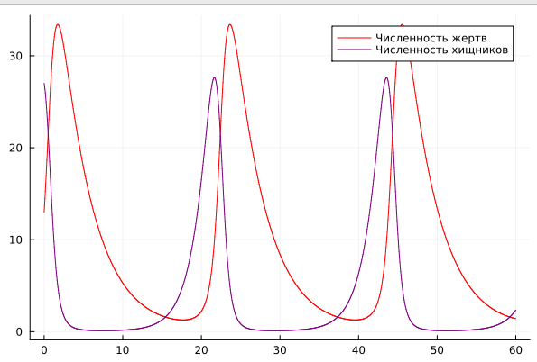
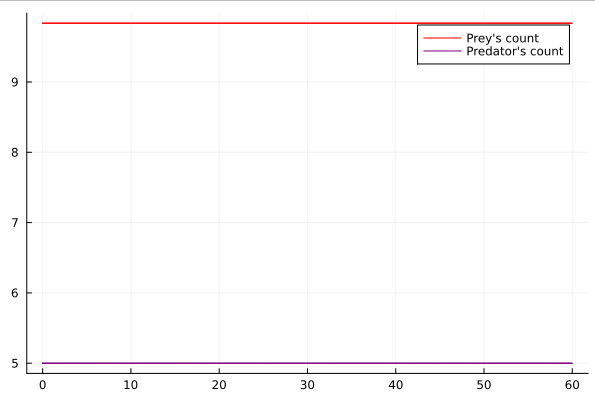
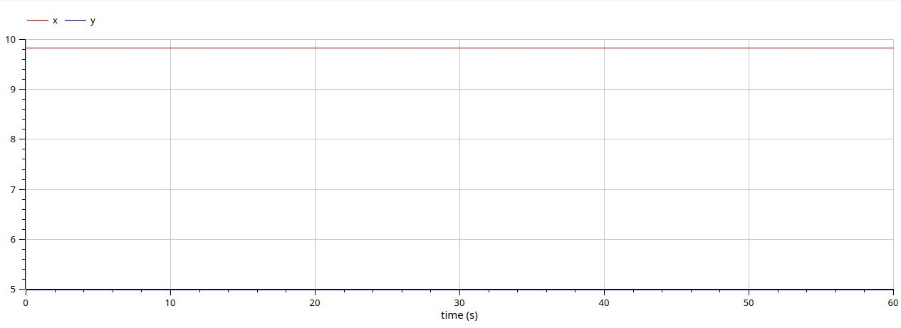

---
## Front matter
lang: ru-RU
title: Лабораторная работа №5
subtitle: Модель "хищник-жертва"
author:
  - Латыпова Диана. НФИбд-02-21
institute:
  - Российский университет дружбы народов имени Патриса Лумубы, Москва, Россия
date: 5 марта 2024

## i18n babel
babel-lang: russian
babel-otherlangs: english

## Formatting pdf
toc: false
toc-title: Содержание
slide_level: 2
aspectratio: 169
section-titles: true
theme: metropolis
header-includes:
 - \metroset{progressbar=frametitle,sectionpage=progressbar,numbering=fraction}
 - '\makeatletter'
 - '\beamer@ignorenonframefalse'
 - '\makeatother'
---

# Информация

## Докладчик

:::::::::::::: {.columns align=center}
::: {.column width="70%"}

  * Латыпова Диана
  * студент группы НФИбд-02-21
  * Российский университет дружбы народов имени Патриса Лумумбы
  * [1032215005@rudn.ru](mailto:1032215005@rudn.ru)
  * <https://github.com/dlatypova>

:::
::: {.column width="30%"}

:::
::::::::::::::

# Вводная часть

## Цели и задачи

- Разобраться в системе "хищник-жертва".
- Реализовать модель "хищник-жертва".

## Задание

Вариант 46:

Для модели «хищник-жертва»:

$$
 \begin{cases}
	\frac{dx}{dt} = -0.25x(t) + 0.05x(t)y(t)
	\\   
	\frac{dy}{dt} = 0.6y(t) - 0.061x(t)y(t)
 \end{cases}
$$

Постройте график зависимости численности хищников от численности жертв, а также графики изменения численности хищников и численности жертв 
при следующих начальных условиях: $x_0=13, y_0=27$
Найдите стационарное состояние системы.

# Теоретическая часть

## Система "хищник-жертва"

**Модель хищник-жертва (Модель Лотки — Вольтерры)**- одна из классических моделей в экологии, описывающая взаимодействие между популяциями двух видов: хищниками и их жертвами. Эта модель предполагает, что изменение численности каждого вида пропорционально численности другого вида и зависит от параметров рождаемости, смертности и взаимодействия между видами. 

## Система "хищник-жертва"

Пусть $x(t)$ - численность популяции хищников в момент времени $t$, $y(t)$ - численность популяции жертв в момент времени $t$.

Тогда изменение численности популяции хищников по времени определяется уравнением:

$$
\frac{dx}{dt} = \alpha*x-\beta*x*y
$$

где $\alpha$ - коэффициент рождаемости хищников, $\beta$ - коэффициент смертности хищников при взаимодействии с жертвами.

## Система "хищник-жертва"

А изменение численности популяции жертв по времени определяется уравнением:

$$
\frac{dy}{dt} = \gamma*y-\sigma*x*y
$$

где $\gamma$ - коэффициент рождаемости жертв, $\sigma$ - коэффициент смертности жертв при взаимодействии с хищниками.

## Стационарное состояние

В стационарном состоянии производные обоих видов по времени равны нулю:

$$
\frac{dx}{dt} = 0
$$

$$
\frac{dy}{dt} = 0
$$

Это означает, что численности видов остаются постоянными, то есть не меняются со временем.

# Графики. Нестационарное состояние

## Julia(1)

Нестационарное состояние(1)(рис. [-@fig:001]):

{#fig:001 width=50%}

## Julia(2)

Нестационарное состояние(2)(рис. [-@fig:002]):

{#fig:002 width=50%}

## OM(1)

Нестационарное состояние(3)(рис. [-@fig:003]):

.jpg){#fig:003 width=50%}

## OM(2)

Нестационарный случай(4)(рис. [-@fig:004]):

.jpg){#fig:004 width=50%}

# Графики. Стационарное состояние

## Julia

Стационарное состояние(1)(рис. [-@fig:005]):

{#fig:005 width=50%}

## OM

Стационарное состояние(1)(рис. [-@fig:006]):

{#fig:006 width=50%}

# Выводы

## Вывод

Я разобралась в системе "хищник-жертва". А также реализовала модель "хищник-жертва" на языке программирования julia и на ПО OpenModelica. Нарисовала графики для нестационарного и стационарного состояния.
