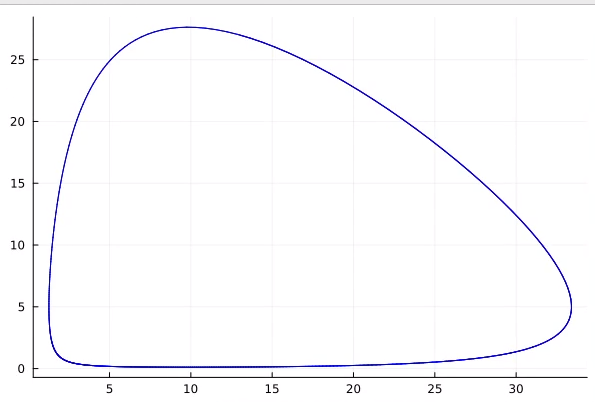
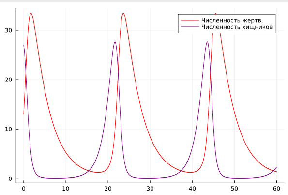
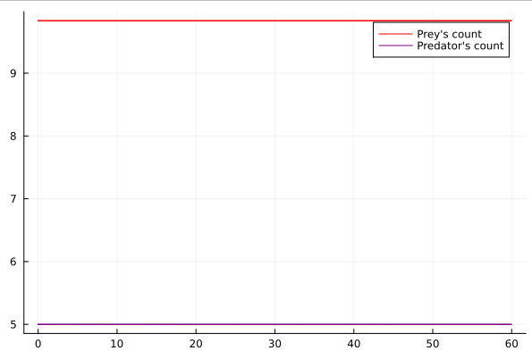
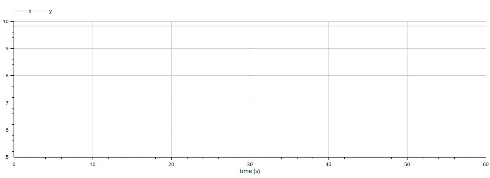

---
## Front matter
title: "Лабораторная работа №5"
subtitle: "Модель хищник-жертва"
author: "Латыпова Диана. НФИбд-02-21"

## Generic otions
lang: ru-RU
toc-title: "Содержание"

## Bibliography
bibliography: bib/cite.bib
csl: pandoc/csl/gost-r-7-0-5-2008-numeric.csl

## Pdf output format
toc: true # Table of contents
toc-depth: 2
lof: true # List of figures
lot: true # List of tables
fontsize: 12pt
linestretch: 1.5
papersize: a4
documentclass: scrreprt
## I18n polyglossia
polyglossia-lang:
  name: russian
  options:
	- spelling=modern
	- babelshorthands=true
polyglossia-otherlangs:
  name: english
## I18n babel
babel-lang: russian
babel-otherlangs: english
## Fonts
mainfont: PT Serif
romanfont: PT Serif
sansfont: PT Sans
monofont: PT Mono
mainfontoptions: Ligatures=TeX
romanfontoptions: Ligatures=TeX
sansfontoptions: Ligatures=TeX,Scale=MatchLowercase
monofontoptions: Scale=MatchLowercase,Scale=0.9
## Biblatex
biblatex: true
biblio-style: "gost-numeric"
biblatexoptions:
  - parentracker=true
  - backend=biber
  - hyperref=auto
  - language=auto
  - autolang=other*
  - citestyle=gost-numeric
## Pandoc-crossref LaTeX customization
figureTitle: "Рис."
tableTitle: "Таблица"
listingTitle: "Листинг"
lofTitle: "Список иллюстраций"
lotTitle: "Список таблиц"
lolTitle: "Листинги"
## Misc options
indent: true
header-includes:
  - \usepackage{indentfirst}
  - \usepackage{float} # keep figures where there are in the text
  - \floatplacement{figure}{H} # keep figures where there are in the text
---

# Цель работы

- Разобраться в системе "хищник-жертва".
- Реализовать модель "хищник-жертва".

# Задание

Вариант 46:

Для модели «хищник-жертва»:

$$
 \begin{cases}
	\frac{dx}{dt} = -0.25x(t) + 0.05x(t)y(t)
	\\   
	\frac{dy}{dt} = 0.6y(t) - 0.061x(t)y(t)
 \end{cases}
$$

Постройте график зависимости численности хищников от численности жертв, а также графики изменения численности хищников и численности жертв 
при следующих начальных условиях: $x_0=13, y_0=27$
Найдите стационарное состояние системы.

# Теоретическое введение

**Модель хищник-жертва (Модель Лотки — Вольтерры)**- одна из классических моделей в экологии, описывающая взаимодействие между популяциями двух видов: хищниками и их жертвами. Эта модель предполагает, что изменение численности каждого вида пропорционально численности другого вида и зависит от параметров рождаемости, смертности и взаимодействия между видами [@wiki:bash]. 

Пусть $x(t)$ - численность популяции хищников в момент времени $t$, $y(t)$ - численность популяции жертв в момент времени $t$.

Тогда изменение численности популяции хищников по времени определяется уравнением:

$$
\frac{dx}{dt} = \alpha*x-\beta*x*y
$$

где $\alpha$ - коэффициент рождаемости хищников, $\beta$ - коэффициент смертности хищников при взаимодействии с жертвами.

А изменение численности популяции жертв по времени определяется уравнением:

$$
\frac{dy}{dt} = \gamma*y-\sigma*x*y
$$

где $\gamma$ - коэффициент рождаемости жертв, $\sigma$ - коэффициент смертности жертв при взаимодействии с хищниками.

**Стационарное состояние.**
В стационарном состоянии производные обоих видов по времени равны нулю [@wiki2:bash]:

$$
\frac{dx}{dt} = 0
$$

$$
\frac{dy}{dt} = 0
$$

Это означает, что численности видов остаются постоянными, то есть не меняются со временем.

# Выполнение лабораторной работы

Для начала реализуем нестационарное состояние.

Код на языке Julia (рис. [-@fig:001]) (рис. [-@fig:002]):

```
using Plots
using DifferentialEquations

# Начальные условия для численности жертв и хищников
x0 = 13
y0 = 27

# Параметры модели хищник-жертва
a = 0.25
b = 0.05
c = 0.6
d = 0.061

# Определение функции для системы дифференциальных уравнений
function ode_fn(du, u, p, t)
    x, y = u
    du[1] = -a * u[1] + b * u[1] * u[2]  # Уравнение для изменения численности жертв
    du[2] = c * u[2] - d * u[1] * u[2]   # Уравнение для изменения численности хищников
end

# Начальные условия и временной интервал
v0 = [x0, y0]
tspan = (0.0, 60.0)

# Определение задачи ОДУ
prob = ODEProblem(ode_fn, v0, tspan)

# Решение задачи
sol = solve(prob, dtmax=0.05)
X = [u[1] for u in sol.u]  # Численность жертв
Y = [u[2] for u in sol.u]  # Численность хищников
T = [t for t in sol.t]     # Время

# Построение графика фазового портрета
plt = plot(
  dpi=300,
  legend=false)

plot!(
  plt,
  X,
  Y,
  color=:blue)

savefig(plt, "out/lab5_1julia.png")

# Построение графиков изменения численности жертв и хищников по времени
plt2 = plot(
  dpi=300,
  legend=true)

plot!(
  plt2,
  T,
  X,
  label="Численность жертв",
  color=:red)

plot!(
  plt2,
  T,
  Y,
  label="Численность хищников",
  color=:purple)

savefig(plt2, "out/lab5_2julia.png")

```

{#fig:001 width=70%}

{#fig:002 width=70%}

Код для ПО OpneModelica (рис. [-@fig:003]) (рис. [-@fig:004]):

```
model lab5_1
Real x;
Real y;
initial equation
x = 13;
y = 27;
equation
der(x) = -0.25*x + 0.05*x*y;
der(y) = 0.6*y - 0.061*x*y;
end lab5_1;
```

.jpg){#fig:003 width=70%}

.jpg){#fig:004 width=70%}

Реализуем стационарное состояние.

Код на языке Julia (рис. [-@fig:005]):

```
using Plots
using DifferentialEquations

# Определение параметров модели
a = 0.25
b = 0.05
c = 0.6
d = 0.061

# Вычисление начальных условий из уравнений равновесия
x0 = c / d
y0 = a / b

# Определение функции для системы дифференциальных уравнений
function ode_fn(du, u, p, t)
    x, y = u
    du[1] = -a*u[1] + b * u[1] * u[2]  # Уравнение для изменения численности жертв
    du[2] = c * u[2] - d * u[1] * u[2]  # Уравнение для изменения численности хищников
end

# Начальные условия и временной интервал
v0 = [x0, y0]
tspan = (0.0, 60.0)

# Определение задачи ОДУ
prob = ODEProblem(ode_fn, v0, tspan)

# Решение задачи
sol = solve(prob, dtmax=0.05)

# Извлечение результатов
X = [u[1] for u in sol.u]
Y = [u[2] for u in sol.u]
T = [t for t in sol.t]

# Построение графиков
plt2 = plot(
  dpi=300,
  legend=true)

plot!(
  plt2,
  T,
  X,
  label="Prey's count",  # Численность жертв
  color=:red)

plot!(
  plt2,
  T,
  Y,
  label="Predator's count",  # Численность хищников
  color=:purple)

savefig(plt2, "out/lab5_3julia.png")  # Сохранение графика в файл

```

{#fig:005 width=70%}

Код для ПО OpneModelica (рис. [-@fig:006]):

```
model lab5_2
Real x;
Real y;
initial equation
x = 0.6 / 0.061;
y = 0.25 / 0.05;
equation
der(x) = -0.25*x + 0.05*x*y;
der(y) = 0.6*y - 0.061*x*y;
end lab5_2;
```

{#fig:006 width=70%}

# Выводы

Я разобралась в системе "хищник-жертва". А также реализовала модель "хищник-жертва" на языке программирования julia и на ПО OpenModelica. Нарисовала графики для нестационарного и стационарного состояния.

# Список литературы{.unnumbered}

::: {#refs}
:::
