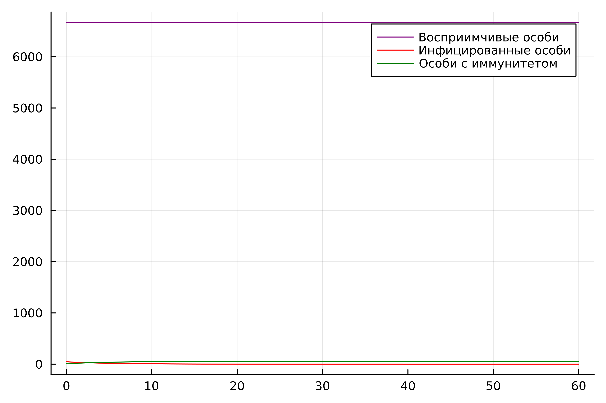
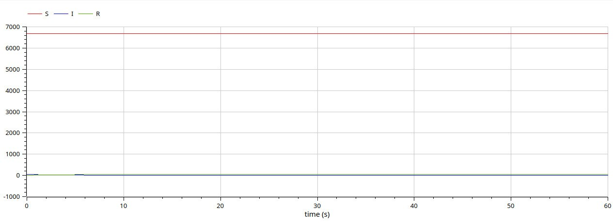
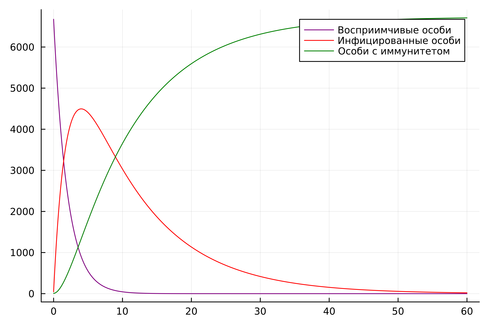
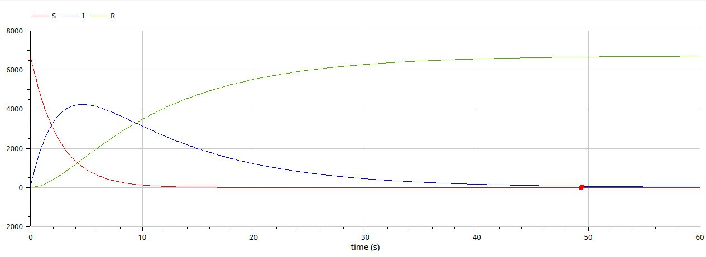

---
## Front matter
lang: ru-RU
title: Лабораторная работа №6
subtitle: Задача об эпидемии
author:
  - Латыпова Диана. НФИбд-02-21
institute:
  - Российский университет дружбы народов имени Патриса Лумумбы, Москва, Россия
date: 6 марта 2024

## i18n babel
babel-lang: russian
babel-otherlangs: english

## Formatting pdf
toc: false
toc-title: Содержание
slide_level: 2
aspectratio: 169
section-titles: true
theme: metropolis
header-includes:
 - \metroset{progressbar=frametitle,sectionpage=progressbar,numbering=fraction}
 - '\makeatletter'
 - '\beamer@ignorenonframefalse'
 - '\makeatother'
---

# Информация

## Докладчик

:::::::::::::: {.columns align=center}
::: {.column width="70%"}

  * Латыпова Диана
  * студент группы НФИбд-02-21
  * Российский университет дружбы народов имени Патриса Лумумбы
  * [1032215005@rudn.ru](mailto:1032215005@rudn.ru)
  * <https://github.com/dlatypova>

:::
::: {.column width="30%"}

:::
::::::::::::::

# Вводная часть

## Цели и задачи

- Построить графики изменения числа особей в каждой из трех групп.
- Рассмотреть два случая, как будет протекать эпидемия.

## Задание

На одном острове вспыхнула эпидемия. Известно, что из всех проживающих на острове 
$(N=6730)$ в момент начала эпидемии $(t=0)$ число заболевших людей 
(являющихся распространителями инфекции) $I(0)=46$, А число здоровых людей с иммунитетом 
к болезни $R(0)=8$. Таким образом, число людей восприимчивых к болезни, 
но пока здоровых, в начальный момент времени $S(0)=N-I(0)-R(0)$.
Постройте графики изменения числа особей в каждой из трех групп.

Рассмотрите, как будет протекать эпидемия в случае:

1.	$I(0)\leq I^*$

2.	$I(0)>I^*$

# Теоретическое введение

## Модель SIR (1)

Модель SIR является одной из базовых моделей в эпидемиологии и описывает динамику распространения инфекционных заболеваний. Она состоит из трех основных дифференциальных уравнений:

Уравнение подверженности к инфекции (Susceptible):

$$\frac{dS}{dt} = \beta SI$$

где $\beta$ - коэффициент заражения, который описывает вероятность передачи инфекции от инфицированного человека к восприимчивому.

## Модель SIR (2)

Уравнение инфицирования (Infected):

$$\frac{dI}{dt} = \beta SI - \gamma I $$

где $\gamma$ - коэффициент выздоровления, который описывает скорость выздоровления или убытия заболевших (выздоровевших или умерших).

## Модель SIR (3)

Уравнение выздоровления (Recovered)$$\frac{dR}{dt} = \beta I$$

## Параметр $I^*$
Параметр $I^*$представляет собой критическое значение заболевших, при котором эпидемия переходит в экспоненциальный рост или наоборот, затухает. Если $I(0)\leq I^*$, то начальные условия не приводят к экспоненциальному росту, и эпидемия подавляется. В противном случае, если $I(0)>I^*$, эпидемия может продолжиться и привести к большему числу заболевших.

Построение графиков происходит путем решения системы дифференциальных уравнений $SIR$ для различных значений времени $t$.

## Основные параметры

$S(t)$ - количество восприимчивых к болезни, но пока здоровых людей в момент времени $t$.

$I(t)$ - количество заболевших (инфицированных) людей в момент времени $t$.

$R(t)$ - количество выздоровевших (реабилитированных) людей в момент времени $t$.

$N$ - общее количество людей на острове.

# 1 случай

## Julia

{#fig:001 width=60%}

## OpenModelica

{#fig:002 width=60%}

# 2 случай

## Julia

{#fig:003 width=60%}

## OpenModelica

{#fig:004 width=60%}

## Анализ

Сравнивая смоделированную задачу на языке программирования Julia и на ПО OpenModelica, можем заметить, что на ПО ОМ коды гораздо меньше и легче в плане их написания, при том, что в конечном итоге имеем абсолютно одинаковые графики. 

# Выводы

## Вывод

Я построила графики изменения числа особей в каждой из трех групп, рассмотрела два случая, как будет протекать эпидемия. Смоделировала задачу об эпидемии на языке программирования Julia и на ПО OpenModelica.

