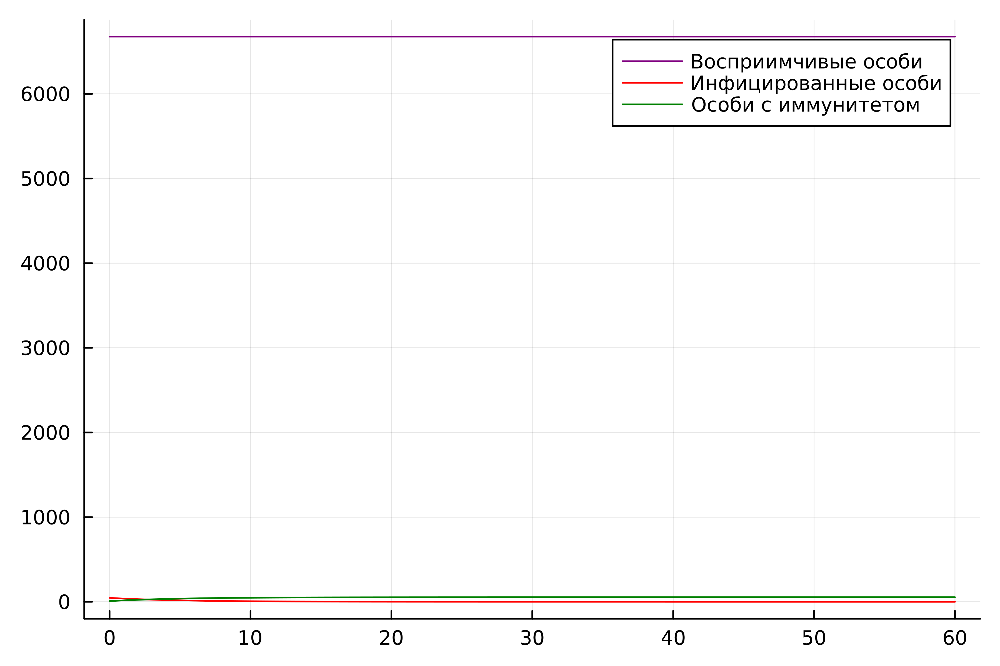
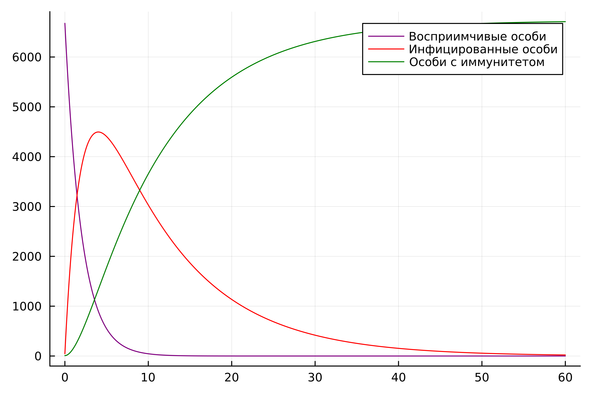
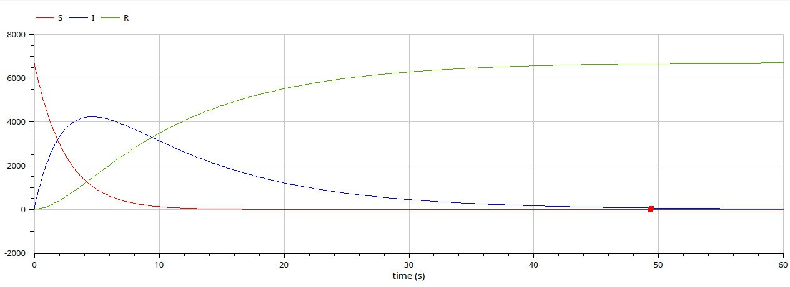

---
## Front matter
title: "Лабораторная работа №6"
subtitle: "Задача об эпидемии"
author: "Латыпова Диана. НФИбд-02-21"

## Generic otions
lang: ru-RU
toc-title: "Содержание"

## Bibliography
bibliography: bib/cite.bib
csl: pandoc/csl/gost-r-7-0-5-2008-numeric.csl

## Pdf output format
toc: true # Table of contents
toc-depth: 2
lof: true # List of figures
lot: true # List of tables
fontsize: 12pt
linestretch: 1.5
papersize: a4
documentclass: scrreprt
## I18n polyglossia
polyglossia-lang:
  name: russian
  options:
	- spelling=modern
	- babelshorthands=true
polyglossia-otherlangs:
  name: english
## I18n babel
babel-lang: russian
babel-otherlangs: english
## Fonts
mainfont: PT Serif
romanfont: PT Serif
sansfont: PT Sans
monofont: PT Mono
mainfontoptions: Ligatures=TeX
romanfontoptions: Ligatures=TeX
sansfontoptions: Ligatures=TeX,Scale=MatchLowercase
monofontoptions: Scale=MatchLowercase,Scale=0.9
## Biblatex
biblatex: true
biblio-style: "gost-numeric"
biblatexoptions:
  - parentracker=true
  - backend=biber
  - hyperref=auto
  - language=auto
  - autolang=other*
  - citestyle=gost-numeric
## Pandoc-crossref LaTeX customization
figureTitle: "Рис."
tableTitle: "Таблица"
listingTitle: "Листинг"
lofTitle: "Список иллюстраций"
lotTitle: "Список таблиц"
lolTitle: "Листинги"
## Misc options
indent: true
header-includes:
  - \usepackage{indentfirst}
  - \usepackage{float} # keep figures where there are in the text
  - \floatplacement{figure}{H} # keep figures where there are in the text
---

# Цель работы

- Построить графики изменения числа особей в каждой из трех групп.
- Рассмотреть два случая, как будет протекать эпидемия.

# Задание

Вариант 46.

На одном острове вспыхнула эпидемия. Известно, что из всех проживающих на острове 
$(N=6730)$ в момент начала эпидемии $(t=0)$ число заболевших людей 
(являющихся распространителями инфекции) $I(0)=46$, А число здоровых людей с иммунитетом 
к болезни $R(0)=8$. Таким образом, число людей восприимчивых к болезни, 
но пока здоровых, в начальный момент времени $S(0)=N-I(0)-R(0)$.
Постройте графики изменения числа особей в каждой из трех групп.

Рассмотрите, как будет протекать эпидемия в случае:

1.	$I(0)\leq I^*$

2.	$I(0)>I^*$

# Теоретическое введение

Модель SIR является одной из базовых моделей в эпидемиологии и описывает динамику распространения инфекционных заболеваний. Она состоит из трех основных дифференциальных уравнений [@pdf:bash]:

Уравнение подверженности к инфекции (Susceptible):

$$\frac{dS}{dt} = \beta SI$$

где $\beta$ - коэффициент заражения, который описывает вероятность передачи инфекции от инфицированного человека к восприимчивому.

Уравнение инфицирования (Infected):

$$\frac{dI}{dt} = \beta SI - \gamma I $$

где $\gamma$ - коэффициент выздоровления, который описывает скорость выздоровления или убытия заболевших (выздоровевших или умерших).

Уравнение выздоровления (Recovered)$$\frac{dR}{dt} = \beta I$$

**Параметр $I^*$.**
Параметр $I^*$представляет собой критическое значение заболевших, при котором эпидемия переходит в экспоненциальный рост или наоборот, затухает. Если $I(0)\leq I^*$, то начальные условия не приводят к экспоненциальному росту, и эпидемия подавляется. В противном случае, если $I(0)>I^*$, эпидемия может продолжиться и привести к большему числу заболевших.

Графики [@graphics:bash] изменения числа особей в каждой из трех групп:
Построение графиков происходит путем решения системы дифференциальных уравнений $SIR$ для различных значений времени $t$.

# Выполнение лабораторной работы

Основные понятия:

$S(t)$ - количество восприимчивых к болезни, но пока здоровых людей в момент времени $t$.

$I(t)$ - количество заболевших (инфицированных) людей в момент времени $t$.

$R(t)$ - количество выздоровевших (реабилитированных) людей в момент времени $t$.

$N$ - общее количество людей на острове.

>Случай1: $I(0)\leq I^*$

Код на языке Julia (рис. [-@fig:001]):

```
# Подключаем необходимые библиотеки
using Plots
using DifferentialEquations

# Указываем начальные данные для моделирования эпидемии
N = 6730     # Общее количество особей на острове
I0 = 46      # Начальное количество заболевших особей
R0 = 8       # Начальное количество особей с иммунитетом
S0 = N - I0 - R0  # Начальное количество здоровых, но восприимчивых особей
alpha = 0.6  # Коэффициент заболеваемости
beta = 0.2   # Коэффициент выздоровления

# Определяем функцию, описывающую систему дифференциальных уравнений
function ode_fn(du, u, p, t)
    S, I, R = u
    # Дифференциальные уравнения модели SIR
    du[1] = 0           # Изменение количества восприимчивых особей (не изменяется)
    du[2] = -beta * u[2]         # Изменение количества инфицированных особей
    du[3] = beta * u[2]          # Изменение количества особей с иммунитетом
end

# Начальные условия и временной интервал моделирования
v0 = [S0, I0, R0]
tspan = (0.0, 60.0)

# Создаем объект, представляющий задачу дифференциальных уравнений (ODEProblem)
prob = ODEProblem(ode_fn, v0, tspan)

# Решаем дифференциальные уравнения
sol = solve(prob, dtmax = 0.05)

# Получаем решение
S = [u[1] for u in sol.u]
I = [u[2] for u in sol.u]
R = [u[3] for u in sol.u]
T = [t for t in sol.t]

# Строим графики
plt = plot(
    dpi = 600,               # Разрешение графика
    legend = :topright      # Позиция легенды
)

# График количества восприимчивых особей
plot!(
    plt,
    T,
    S,
    label = "Восприимчивые особи",  # Подпись для легенды
    color = :purple                   # Цвет графика
)

# График количества инфицированных особей
plot!(
    plt,
    T,
    I,
    label = "Инфицированные особи", # Подпись для легенды
    color = :red                      # Цвет графика
)

# График количества особей с иммунитетом
plot!(
    plt,
    T,
    R,
    label = "Особи с иммунитетом",   # Подпись для легенды
    color = :green                    # Цвет графика
)

# Сохраняем график в файл
savefig(plt, "jullab6_1.png")

```

{#fig:001 width=70%}

Код на ПО OpenModelica (рис. [-@fig:002]):

```
model lab6_1
Real S;
Real I;
Real R;
Real N = 6730;
Real alpha = 0.6;
Real beta = 0.2;
initial equation
I = 46;
R = 8;
S = N - I - R;
equation
der(S) = 0;
der(I) = -beta*I;
der(R) = beta*I;
end lab6_1;
```

{#fig:002 width=70%}

>Случай2: $I(0) > I^*$

Код на языке Julia (рис. [-@fig:003]):

```
using Plots
using DifferentialEquations

N = 6730
I0 = 46 # заболевшие особи
R0 = 8 # особи с иммунитетом
S0 = N - I0 - R0 # здоровые, но восприимчивые особи
alpha = 0.5 # коэффициент заболеваемости
beta = 0.1 # коэффициент выздоровления

function ode_fn(du, u, p, t)
    S, I, R = u
    du[1] = -alpha*u[1]
    du[2] = alpha*u[1] - beta*u[2]
    du[3] = beta*I
end

v0 = [S0, I0, R0]
tspan = (0.0, 60.0)
prob = ODEProblem(ode_fn, v0, tspan)
sol = solve(prob, dtmax = 0.05)

S = [u[1] for u in sol.u]
I = [u[2] for u in sol.u]
R = [u[3] for u in sol.u]
T = [t for t in sol.t]

plt = plot(
  dpi = 600,
  legend = :topright)
plot!(
  plt,
  T,
  S,
  label = "Восприимчивые особи",
  color = :purple)
plot!(
  plt,
  T,
  I,
  label = "Инфицированные особи",
  color = :red)
plot!(
  plt,
  T,
  R,
  label = "Особи с иммунитетом",
  color = :green)

savefig(plt, "jullab6_2.png")
```

{#fig:003 width=70%}

Код на ПО OpenModelica (рис. [-@fig:004]):

```
model lab6_2
Real S;
Real I;
Real R;
Real N = 6730;
Real alpha = 0.4;
Real beta = 0.1;
initial equation
I = 46;
R = 8;
S = N - I - R;
equation
der(S) = -alpha*S;
der(I) = alpha*S - beta*I;
der(R) = beta*I;
end lab6_2;
```

{#fig:004 width=70%}

**Анализ.**
Сравнивая смоделированную задачу на языке программирования Julia и на ПО OpenModelica, можем заметить, что на ПО ОМ коды гораздо меньше и легче в плане их написания, при том, что в конечном итоге имеем абсолютно одинаковые графики. 

# Выводы

Я построила графики изменения числа особей в каждой из трех групп, рассмотрела два случая, как будет протекать эпидемия. Смоделировала задачу об эпидемии на языке программирования Julia и на ПО OpenModelica.

# Список литературы{.unnumbered}

::: {#refs}
:::
