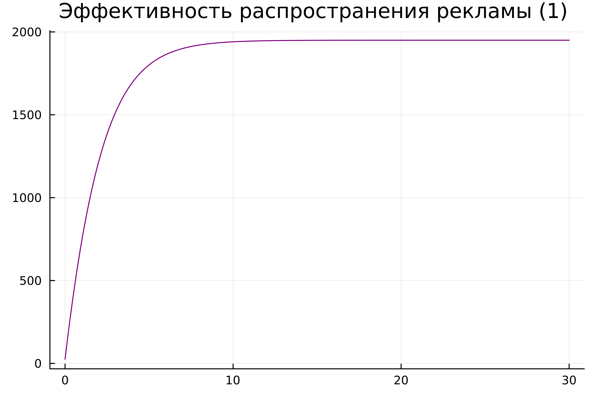
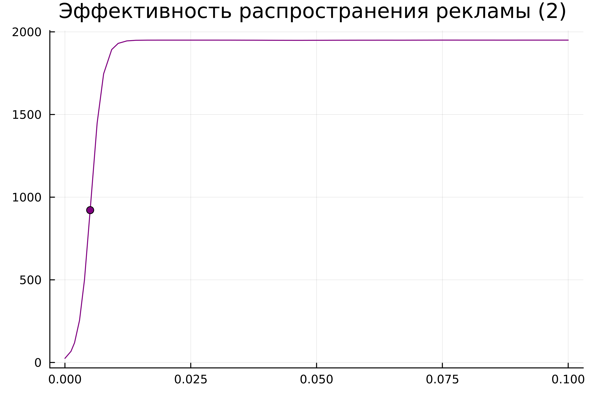
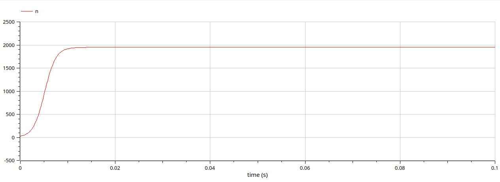
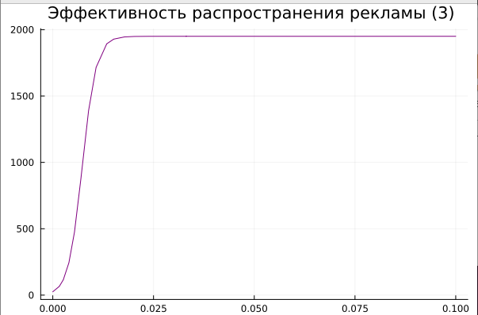
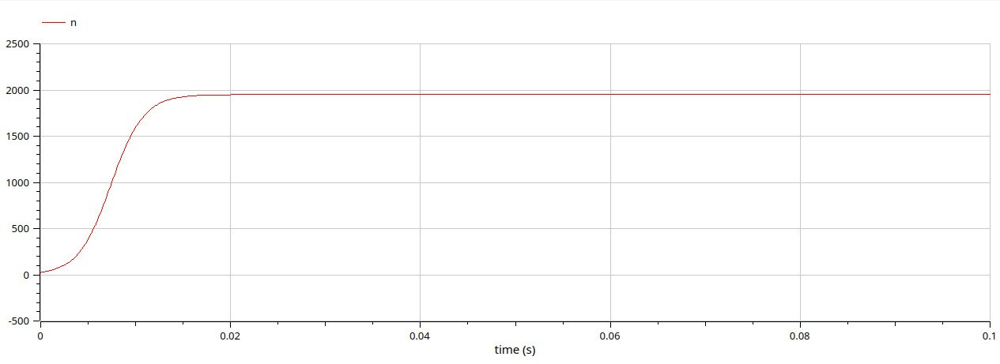

---
## Front matter
lang: ru-RU
title: Лабораторная работа №7
subtitle: Эффективность рекламы
author:
  - Латыпова Диана. НФИбд-02-21
institute:
  - Российский университет дружбы народов имени Патриса Лумумбы, Москва, Россия
date: 6 марта 2024

## i18n babel
babel-lang: russian
babel-otherlangs: english

## Formatting pdf
toc: false
toc-title: Содержание
slide_level: 2
aspectratio: 169
section-titles: true
theme: metropolis
header-includes:
 - \metroset{progressbar=frametitle,sectionpage=progressbar,numbering=fraction}
 - '\makeatletter'
 - '\beamer@ignorenonframefalse'
 - '\makeatother'
---

# Информация

## Докладчик

:::::::::::::: {.columns align=center}
::: {.column width="70%"}

  * Латыпова Диана
  * студент группы НФИбд-02--21
  * Российский университет дружбы народов имени Патриса Лумумбы
  * [1032215005@rudn.ru](mailto:1032215005@rudn.ru)
  * <https://github.com/dlatypova>

:::
::: {.column width="30%"}

:::
::::::::::::::

# Вводная часть

## Цели и задачи

- Изучить математическую модель распространения рекламы
- Построить графики распространения рекламы
- Найти в какой момент времени скорость распространения рекламы будет иметь максимальное значение

## Задание

Постройте график распространения рекламы, математическая модель которой описывается следующим уравнением:

1.	$\frac{dn}{dt} = (0.444 + 0.000055n(t))(N-n(t))$
2.	$\frac{dn}{dt} = (0.000065 + 0.433n(t))(N-n(t))$
3.	$\frac{dn}{dt} = (0.5\cos{12t} + 0.3\cos{(13t)}  n(t))(N-n(t))$

При этом объем аудитории $N = 1950$, в начальный момент о товаре знает 25 человек.

Для случая 2 определите в какой момент времени скорость распространения рекламы будет иметь максимальное значение.

# Теоретическая часть

## Модель распространения рекламы (1)

Для моделирования распространения рекламы мы используем дифференциальное уравнение в виде:

$\frac{dn}{dt} = (a + bn)(N-n)$

где:
$n(t)$ - количество людей, которые узнали о товаре к моменту времени $t$, $N$ - общее количество людей в аудитории, $a$ и $b$ - коэффициенты, определяющие скорость распространения рекламы.

## Модель распространения рекламы (2)

Для решения дифференциальных уравнений этого типа используются методы численного интегрирования, такие как метод Эйлера, метод Рунге-Кутты или другие.

После того как мы найдем решение дифференциального уравнения, мы можем построить график, отображающий зависимость $n(t)$ от $t.$

## Определение момента максимальной скорости распространения рекламы

Для определения момента времени, когда скорость распространения рекламы максимальна, необходимо найти производную $dn/dt$ и найти ее нули. Это можно сделать аналитически или численно.

# Случай1 $\frac{dn}{dt} = (0.444 + 0.000055n(t))(N-n(t))$

## Julia

{#fig:001 width=60%}

## OpenModelica

{#fig:002 width=60%}

# Случай2 $\frac{dn}{dt} = (0.000065 + 0.433n(t))(N-n(t))$

## Julia

{#fig:003 width=60%}

## OpenModelica

{#fig:004 width=60%}

# Случай3 $\frac{dn}{dt} = (0.5\cos{12t} + 0.3\cos{(13t)}  n(t))(N-n(t))$

## Julia

{#fig:005 width=60%}

## OpenModelica

{#fig:006 width=60%}

## Анализ

Сравнивая смоделированную задачу на языке программирования Julia и на ПО OpenModelica, можем заметить, что на ПО ОМ коды гораздо меньше и легче в плане их написания, при том, что в конечном итоге имеем абсолютно одинаковые графики. 

# Выводы

## Выводы

Я изучила математическую модель распространения рекламы, построила графики распространения рекламы на языке Julia и на ПО ОМ, а также нашла в какой момент времени скорость распространения рекламы будет иметь максимальное значение с помощью языка Julia.
