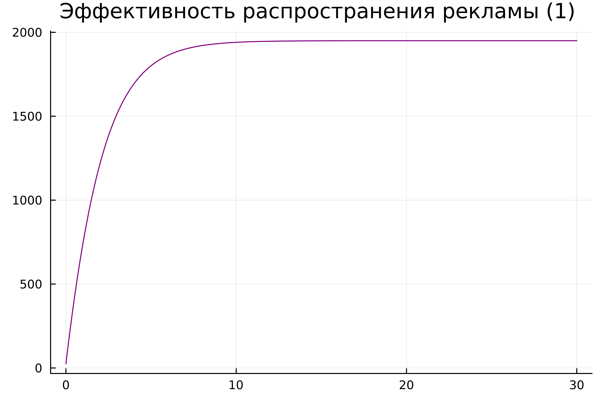
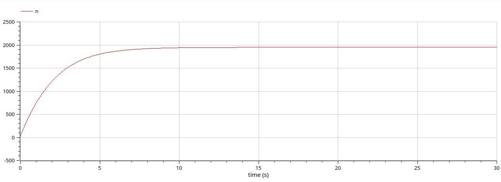
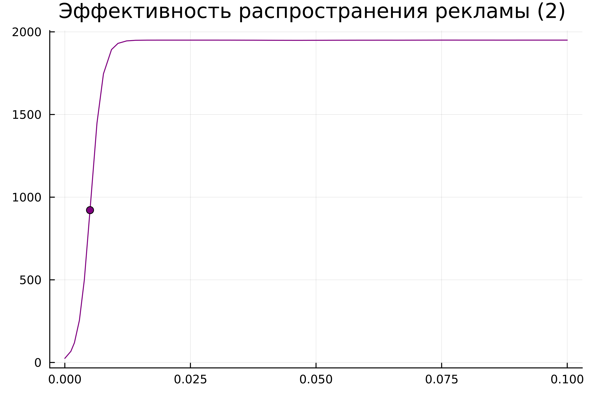
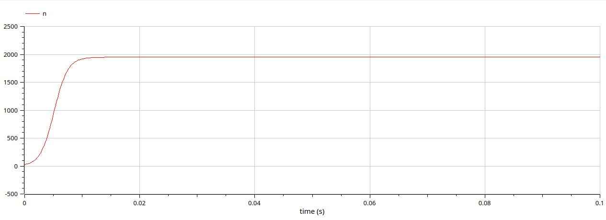
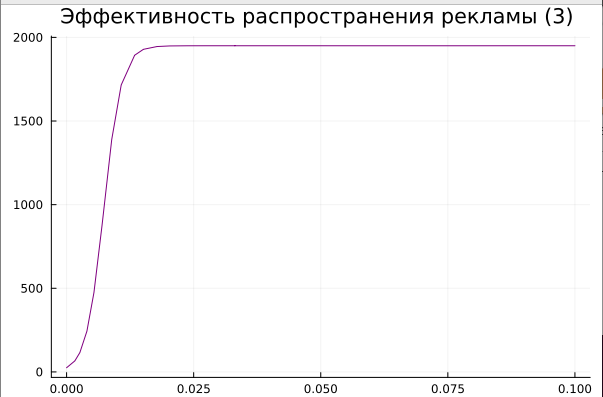
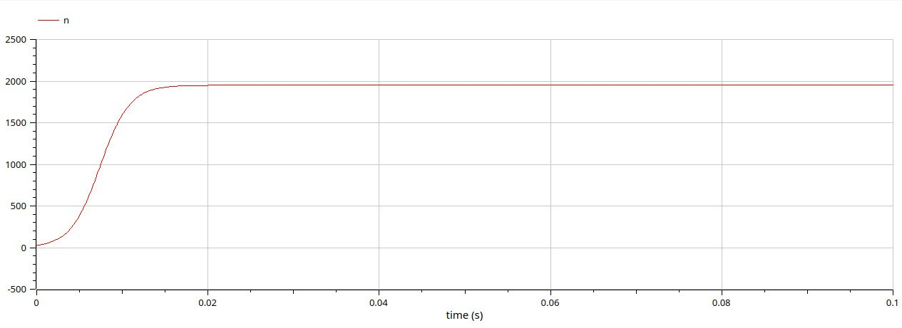

---
## Front matter
title: "лабораторная работа №7"
subtitle: "Эффективность рекламы"
author: "Латыпова Диана. НФИбд-02-21"

## Generic otions
lang: ru-RU
toc-title: "Содержание"

## Bibliography
bibliography: bib/cite.bib
csl: pandoc/csl/gost-r-7-0-5-2008-numeric.csl

## Pdf output format
toc: true # Table of contents
toc-depth: 2
lof: true # List of figures
lot: true # List of tables
fontsize: 12pt
linestretch: 1.5
papersize: a4
documentclass: scrreprt
## I18n polyglossia
polyglossia-lang:
  name: russian
  options:
	- spelling=modern
	- babelshorthands=true
polyglossia-otherlangs:
  name: english
## I18n babel
babel-lang: russian
babel-otherlangs: english
## Fonts
mainfont: PT Serif
romanfont: PT Serif
sansfont: PT Sans
monofont: PT Mono
mainfontoptions: Ligatures=TeX
romanfontoptions: Ligatures=TeX
sansfontoptions: Ligatures=TeX,Scale=MatchLowercase
monofontoptions: Scale=MatchLowercase,Scale=0.9
## Biblatex
biblatex: true
biblio-style: "gost-numeric"
biblatexoptions:
  - parentracker=true
  - backend=biber
  - hyperref=auto
  - language=auto
  - autolang=other*
  - citestyle=gost-numeric
## Pandoc-crossref LaTeX customization
figureTitle: "Рис."
tableTitle: "Таблица"
listingTitle: "Листинг"
lofTitle: "Список иллюстраций"
lotTitle: "Список таблиц"
lolTitle: "Листинги"
## Misc options
indent: true
header-includes:
  - \usepackage{indentfirst}
  - \usepackage{float} # keep figures where there are in the text
  - \floatplacement{figure}{H} # keep figures where there are in the text
---

# Цель работы

- Изучить математическую модель распространения рекламы
- Построить графики распространения рекламы
- Найти в какой момент времени скорость распространения рекламы будет иметь максимальное значение

# Задание

Вариант 46.

Постройте график распространения рекламы, математическая модель которой описывается следующим уравнением:

1.	$\frac{dn}{dt} = (0.444 + 0.000055n(t))(N-n(t))$
2.	$\frac{dn}{dt} = (0.000065 + 0.433n(t))(N-n(t))$
3.	$\frac{dn}{dt} = (0.5\cos{12t} + 0.3\cos{(13t)}  n(t))(N-n(t))$

При этом объем аудитории $N = 1950$, в начальный момент о товаре знает 25 человек.

Для случая 2 определите в какой момент времени скорость распространения рекламы будет иметь максимальное значение.

# Теоретическое введение

**Модель распространения рекламы [@pdf:bash].**
Для моделирования распространения рекламы мы используем дифференциальное уравнение в виде:

$\frac{dn}{dt} = (a + bn)(N-n)$

где:
$n(t)$ - количество людей, которые узнали о товаре к моменту времени $t$, $N$ - общее количество людей в аудитории, $a$ и $b$ - коэффициенты, определяющие скорость распространения рекламы.

Для решения дифференциальных уравнений этого типа используются методы численного интегрирования, такие как метод Эйлера, метод Рунге-Кутты или другие.

После того как мы найдем решение дифференциального уравнения, мы можем построить график, отображающий зависимость $n(t)$ от $t.$

**Определение момента максимальной скорости распространения рекламы.**
Для определения момента времени, когда скорость распространения рекламы максимальна, необходимо найти производную $dn/dt$ и найти ее нули. Это можно сделать аналитически или численно.

# Выполнение лабораторной работы

>Случай1. $\frac{dn}{dt} = (0.444 + 0.000055n(t))(N-n(t))$

Код на Julia (рис. [-@fig:001]):
```
using Plots
using DifferentialEquations

N = 1950
n0 = 25

function ode_fn(du, u, p, t)
    (n) = u
    du[1] = (0.444 + 0.000055*u[1])*(N - u[1])
end

v0 = [n0]
tspan = (0.0, 30.0)
prob = ODEProblem(ode_fn, v0, tspan)
sol = solve(prob, dtmax = 0.05)
n = [u[1] for u in sol.u]
T = [t for t in sol.t]

plt = plot(
  dpi = 600,
  title = "Эффективность распространения рекламы (1) ",
  legend = false)
plot!(
  plt,
  T,
  n,
  color = :purple)

savefig(plt, "jullab7_1.png")
```

{#fig:001 width=70%}

Код на ПО OpenModelica (рис. [-@fig:002]):
```
model lab7_1
Real N = 1950;
Real n;
initial equation
n = 25;
equation
der(n) = (0.444 + 0.000055*n)*(N-n);
end lab7_1;
```

{#fig:002 width=70%}

>Случай2. $\frac{dn}{dt} = (0.000065 + 0.433n(t))(N-n(t))$

Код на Julia (рис. [-@fig:003]):
```
using Plots             # Импорт пакета для построения графиков
using DifferentialEquations   # Импорт пакета для решения дифференциальных уравнений

N = 1950                # Общее количество людей в аудитории
n0 = 25                 # Начальное количество людей, знающих о товаре

# Определение функции, описывающей дифференциальное уравнение
function ode_fn(du, u, p, t)
    (n) = u
    du[1] = (0.000065 + 0.433*u[1])*(N - u[1])  # Дифференциальное уравнение
end

v0 = [n0]               # Начальные условия
tspan = (0.0, 0.1)      # Временной интервал

# Определение задачи для решения дифференциального уравнения
prob = ODEProblem(ode_fn, v0, tspan)

# Решение дифференциального уравнения
sol = solve(prob)

# Извлечение значений n(t) и времени t из решения
n = [u[1] for u in sol.u]
T = [t for t in sol.t]

# Нахождение максимальной скорости распространения рекламы и соответствующих значений времени и n(t)
max_dn = 0;
max_dn_t = 0;
max_dn_n = 0;
for (i, t) in enumerate(T)
    if sol(t, Val{1})[1] > max_dn
        global max_dn = sol(t, Val{1})[1]
        global max_dn_t = t
        global max_dn_n = n[i]
    end
end

# Построение графика
plt = plot(
  dpi = 600,            # Разрешение графика
  title = "Эффективность распространения рекламы (2) ",   # Заголовок графика
  legend = false)       # Отключение легенды

# Добавление графика n(t)
plot!(
  plt,
  T,
  n,
  color = :purple)     # Цвет графика

# Добавление точки максимальной скорости распространения рекламы
plot!(
  plt,
  [max_dn_t],
  [max_dn_n],
  seriestype = :scatter,
  color = :purple)      # Цвет точки

# Сохранение графика в файл
savefig(plt, "jullab7_2.png")

```

{#fig:003 width=70%}

Код на ПО OpenModelica (рис. [-@fig:004]):
```
model lab7_2
Real N = 1950;
Real n;
initial equation
n = 25;
equation
der(n) = (0.000065 + 0.433*n)*(N-n);
end lab7_2;
```

{#fig:004 width=70%}

>Случай3. $\frac{dn}{dt} = (0.5\cos{12t} + 0.3\cos{(13t)}  n(t))(N-n(t))$

Код на Julia (рис. [-@fig:005]):
```
using Plots
using DifferentialEquations

N = 1950
n0 = 25

function ode_fn(du, u, p, t)
    (n) = u
    du[1] = (0.5*cos(12*t) + 0.3*cos(13*t)*u[1])*(N - u[1])
end

v0 = [n0]
tspan = (0.0, 0.1)
prob = ODEProblem(ode_fn, v0, tspan)
sol = solve(prob, dtmax = 0.05)
n = [u[1] for u in sol.u]
T = [t for t in sol.t]

plt = plot(
  dpi = 600,
  title = "Эффективность распространения рекламы (3) ",
  legend = false)
plot!(
  plt,
  T,
  n,
  color = :purple)

savefig(plt, "jullab7_3.png")
```

{#fig:005 width=70%}

Код на ПО OpenModelica (рис. [-@fig:006]):
```
model lab7_3
Real N = 1950;
Real n;
initial equation
n = 25;
equation
der(n) = (0.5*cos(12*time) * time + 0.3*cos(13*time)*n)*(N-n);
end lab7_3;
```

{#fig:006 width=70%}

**Анализ.**
Сравнивая смоделированную задачу на языке программирования Julia и на ПО OpenModelica, можем заметить, что на ПО ОМ коды гораздо меньше и легче в плане их написания, при том, что в конечном итоге имеем абсолютно одинаковые графики. 

# Выводы

Я изучила математическую модель распространения рекламы, построила графики распространения рекламы на языке Julia и на ПО ОМ, а также нашла в какой момент времени скорость распространения рекламы будет иметь максимальное значение с помощью языка Julia.

# Список литературы{.unnumbered}

::: {#refs}
:::
