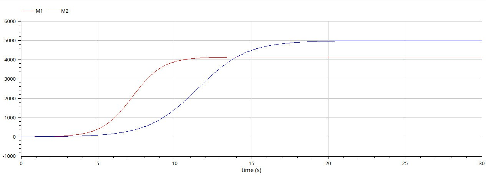

---
## Front matter
lang: ru-RU
title: Лабораторная работа №8
subtitle: Модель конкуренции двух фирм
author:
  - Латыпова Диана. НФИбд-02-21
institute:
  - Российский университет дружбы народов имени Патриса Лумумбы, Москва, Россия
date: 6 марта 2024

## i18n babel
babel-lang: russian
babel-otherlangs: english

## Formatting pdf
toc: false
toc-title: Содержание
slide_level: 2
aspectratio: 169
section-titles: true
theme: metropolis
header-includes:
 - \metroset{progressbar=frametitle,sectionpage=progressbar,numbering=fraction}
 - '\makeatletter'
 - '\beamer@ignorenonframefalse'
 - '\makeatother'
---

# Информация

## Докладчик

:::::::::::::: {.columns align=center}
::: {.column width="70%"}

  * Латыпова Диана
  * студент группы НФИбд-02-21вероятностей
  * Российский университет дружбы народов имени Патриса Лумумбы
  * [1032215005@rudn.ru](mailto:1032215005@rudn.ru)
  * <https://github.com/dlatypova>

:::
::: {.column width="30%"}

:::
::::::::::::::

# Вводная часть

## Цели и задачи

- Познакомиться с моделью конкуренции двух фирм.
- Рассмотреть два случая и построить графики изменения оборотных средств фирмы 1 и фирмы 2 без учета постоянных издержек и с веденной нормировкой для каждого из двух случаев.

## Задание (1)

>Случай 1

Рассмотрим две фирмы, производящие взаимозаменяемые товары одинакового качества и находящиеся в одной рыночной нише. Считаем, что в рамках нашей модели конкурентная борьба ведётся только рыночными методами. То есть, конкуренты могут влиять на противника путем изменения параметров своего производства: себестоимость, время цикла, но не могут прямо вмешиваться в ситуацию на рынке («назначать» цену или влиять на потребителей каким-либо иным способом.) Будем считать, что постоянные издержки пренебрежимо малы, и в модели учитывать не будем. 

## Задание (2)

В этом случае динамика изменения объемов продаж фирмы 1 и фирмы 2 описывается следующей системой уравнений:

$$\frac{dM_1}{d\Theta} = M_1 - \frac{b}{c_1}M_1 M_2 - \frac{a1}{c1} M_1^2 $$

$$ \frac{dM_2}{d\Theta} = \frac{c_2}{c_1} M_2 - \frac{b}{c_1} M_1 M_2 - \frac{a_2}{c_1} M_2^2$$

## Задание (3)

где 

$$ a_1 = \frac{p_{cr}}{\tau_1^2 \widetilde{p}_1^2 Nq } $$
$$ a_2 = \frac{p_{cr}}{\tau_2^2 \widetilde{p}_2^2 Nq } $$ 
$$ b = \frac{p_{cr}}{\tau_1^2 \widetilde{p}_1^2 \tau_2^2 \widetilde{p}_2^2 Nq} $$
$$ c_1 = \frac{p_{cr} - \widetilde{p}_1}{\tau_1 \widetilde{p}_1} $$
$$ c_2 = \frac{p_{cr} - \widetilde{p}_2}{\tau_2 \widetilde{p}_2} $$

также введена нормировка $t = c_1 \Theta$

## Задание (4)

>Случай 2

Рассмотрим модель, когда, помимо экономического фактора влияния (изменение себестоимости, производственного цикла, использование кредита и т.п.), используются еще и социально-психологические факторы – формирование общественного предпочтения одного товара другому, не зависимо от их качества и цены. В этом случае взаимодействие двух фирм будет зависеть друг от друга, соответственно коэффициент перед $M_1 M_2$ будет отличаться. 

## Задание (5)

Пусть в рамках рассматриваемой модели динамика изменения объемов продаж фирмы 1 и фирмы 2 описывается следующей системой уравнений:

$$\frac{dM_1}{d\Theta} = M_1 - \frac{b}{c_1}M_1 M_2 - \frac{a1}{c1} M_1^2 $$

$$ \frac{dM_2}{d\Theta} = \frac{c_2}{c_1} M_2 - (\frac{b}{c_1} + 0.00026) M_1 M_2 - \frac{a_2}{c_1} M_2^2$$

## Задание (6)

Для обоих случаев рассмотрим задачу со следующими начальными условиями и параметрами

$$ M_0^1=3 \: M_0^2=4 $$
$$ p_{cr}=45 \: N=30 \: q=1 $$
$$ \tau_1=21 \: \tau_2=18 $$
$$ \widetilde{p}_1=8 \: \widetilde{p}_2=13 $$

# Теоретическая часть

## Модель динамики изменения объемов продаж фирмы

Представлена модель динамики изменения объемов продаж двух конкурирующих фирм, которые производят взаимозаменяемые товары одинакового качества и находятся в одной рыночной нише. Модель описывается системой дифференциальных уравнений, где каждая фирма принимает во внимание свой объем продаж, объем продаж конкурента, а также внешние экономические и социально-психологические факторы.

## Влияние социально-психологических факторов
Во втором случае добавляется влияние социально-психологических факторов, таких как формирование общественного предпочтения одного товара другому, независимо от их качества и цены. Это может привести к изменению коэффициента перед взаимодействием объемов продаж обеих фирм.

Для обеих фирм у нас есть система дифференциальных уравнений, описывающих динамику их объемов продаж. 

## Решение

Для решения задачи необходимо найти решение системы дифференциальных уравнений, описывающих динамику изменения объемов продаж обеих фирм. Это позволит понять, как изменяются объемы продаж в зависимости от экономических и социально-психологических факторов, а также какие стратегии могут быть наиболее эффективными для фирмы в конкурентной борьбе.

# Случай 1

## Julia

{#fig:001 width=60%}

## OpenModelica

{#fig:002 width=60%}

# Случай 2

## Julia

{#fig:003 width=60%}

## OpenModelica

{#fig:004 width=60%}

## Анализ

Сравнивая смоделированную задачу на языке программирования Julia и на ПО OpenModelica, можем заметить, что на ПО ОМ коды гораздо меньше и легче в плане их написания, при том, что в конечном итоге имеем абсолютно одинаковые графики. 

# Выводы

## Выводы

Я познакомилась с моделью конкуренции двух фирм. А также рассмотрела два случая и построила графики изменения оборотных средств фирмы 1 и фирмы 2 без учета постоянных издержек и с веденной нормировкой для каждого из двух случаев с помощью языка программирования Julia и ПО OpenModelica.

