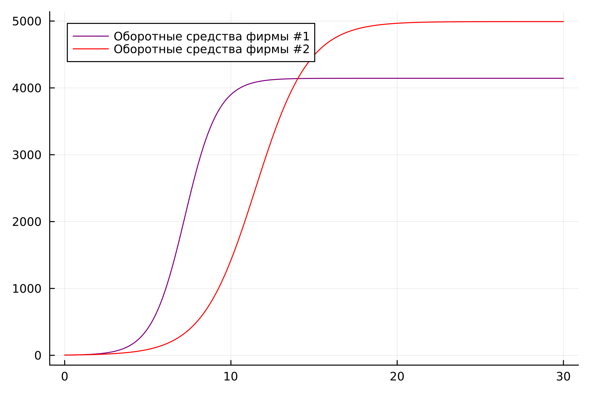
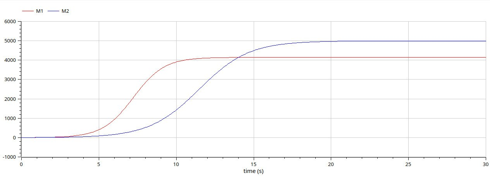
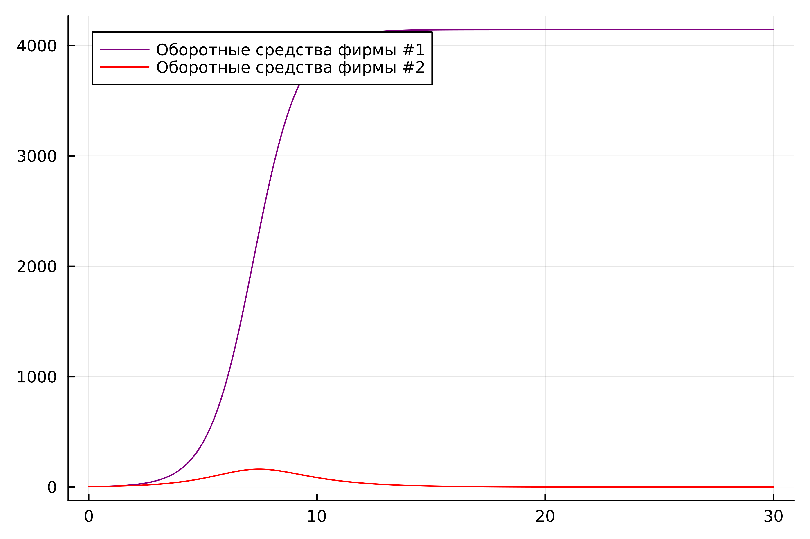

---
## Front matter
title: "Лабораторная работа №8"
subtitle: "Модель конкуренции двух фирм"
author: "Латыпова Диана. НФИбд-02-21"

## Generic otions
lang: ru-RU
toc-title: "Содержание"

## Bibliography
bibliography: bib/cite.bib
csl: pandoc/csl/gost-r-7-0-5-2008-numeric.csl

## Pdf output format
toc: true # Table of contents
toc-depth: 2
lof: true # List of figures
lot: true # List of tables
fontsize: 12pt
linestretch: 1.5
papersize: a4
documentclass: scrreprt
## I18n polyglossia
polyglossia-lang:
  name: russian
  options:
	- spelling=modern
	- babelshorthands=true
polyglossia-otherlangs:
  name: english
## I18n babel
babel-lang: russian
babel-otherlangs: english
## Fonts
mainfont: PT Serif
romanfont: PT Serif
sansfont: PT Sans
monofont: PT Mono
mainfontoptions: Ligatures=TeX
romanfontoptions: Ligatures=TeX
sansfontoptions: Ligatures=TeX,Scale=MatchLowercase
monofontoptions: Scale=MatchLowercase,Scale=0.9
## Biblatex
biblatex: true
biblio-style: "gost-numeric"
biblatexoptions:
  - parentracker=true
  - backend=biber
  - hyperref=auto
  - language=auto
  - autolang=other*
  - citestyle=gost-numeric
## Pandoc-crossref LaTeX customization
figureTitle: "Рис."
tableTitle: "Таблица"
listingTitle: "Листинг"
lofTitle: "Список иллюстраций"
lotTitle: "Список таблиц"
lolTitle: "Листинги"
## Misc options
indent: true
header-includes:
  - \usepackage{indentfirst}
  - \usepackage{float} # keep figures where there are in the text
  - \floatplacement{figure}{H} # keep figures where there are in the text
---

# Цель работы

- Познакомиться с моделью конкуренции двух фирм.
- Рассмотреть два случая и построить графики изменения оборотных средств фирмы 1 и фирмы 2 без учета постоянных издержек и с веденной нормировкой для каждого из двух случаев.

# Задание

Вариант 46

>Случай 1

Рассмотрим две фирмы, производящие взаимозаменяемые товары одинакового качества и находящиеся в одной рыночной нише. Считаем, что в рамках нашей модели конкурентная борьба ведётся только рыночными методами. То есть, конкуренты могут влиять на противника путем изменения параметров своего производства: себестоимость, время цикла, но не могут прямо вмешиваться в ситуацию на рынке («назначать» цену или влиять на потребителей каким-либо иным способом.) Будем считать, что постоянные издержки пренебрежимо малы, и в модели учитывать не будем. В этом случае динамика изменения объемов продаж фирмы 1 и фирмы 2 описывается следующей системой уравнений:

$$\frac{dM_1}{d\Theta} = M_1 - \frac{b}{c_1}M_1 M_2 - \frac{a1}{c1} M_1^2 $$

$$ \frac{dM_2}{d\Theta} = \frac{c_2}{c_1} M_2 - \frac{b}{c_1} M_1 M_2 - \frac{a_2}{c_1} M_2^2$$
где 

$$ a_1 = \frac{p_{cr}}{\tau_1^2 \widetilde{p}_1^2 Nq } $$
$$ a_2 = \frac{p_{cr}}{\tau_2^2 \widetilde{p}_2^2 Nq } $$ 
$$ b = \frac{p_{cr}}{\tau_1^2 \widetilde{p}_1^2 \tau_2^2 \widetilde{p}_2^2 Nq} $$
$$ c_1 = \frac{p_{cr} - \widetilde{p}_1}{\tau_1 \widetilde{p}_1} $$
$$ c_2 = \frac{p_{cr} - \widetilde{p}_2}{\tau_2 \widetilde{p}_2} $$

также введена нормировка $t = c_1 \Theta$

>Случай 2

Рассмотрим модель, когда, помимо экономического фактора влияния (изменение себестоимости, производственного цикла, использование кредита и т.п.), используются еще и социально-психологические факторы – формирование общественного предпочтения одного товара другому, не зависимо от их качества и цены. В этом случае взаимодействие двух фирм будет зависеть друг от друга, соответственно коэффициент перед $M_1 M_2$ будет отличаться. Пусть в рамках рассматриваемой модели динамика изменения объемов продаж фирмы 1 и фирмы 2 описывается следующей системой уравнений:

$$\frac{dM_1}{d\Theta} = M_1 - \frac{b}{c_1}M_1 M_2 - \frac{a1}{c1} M_1^2 $$

$$ \frac{dM_2}{d\Theta} = \frac{c_2}{c_1} M_2 - (\frac{b}{c_1} + 0.00026) M_1 M_2 - \frac{a_2}{c_1} M_2^2$$

Для обоих случаев рассмотрим задачу со следующими начальными условиями и параметрами

$$ M_0^1=3 \: M_0^2=4 $$
$$ p_{cr}=45 \: N=30 \: q=1 $$
$$ \tau_1=21 \: \tau_2=18 $$
$$ \widetilde{p}_1=8 \: \widetilde{p}_2=13 $$

# Теоретическое введение

**Модель динамики изменения объемов продаж фирмы.**
Представлена модель динамики изменения объемов продаж двух конкурирующих фирм [@info:bash], которые производят взаимозаменяемые товары одинакового качества и находятся в одной рыночной нише. Модель описывается системой дифференциальных уравнений, где каждая фирма принимает во внимание свой объем продаж, объем продаж конкурента, а также внешние экономические и социально-психологические факторы.

**Влияние экономических факторов.**
В модели рассматривается влияние экономических факторов на объемы продаж, таких как себестоимость товара, время производственного цикла и другие параметры производства. Фирмы могут варьировать эти параметры в своих стратегиях конкуренции на рынке.

**Влияние социально-психологических факторов.**
Во втором случае добавляется влияние социально-психологических факторов, таких как формирование общественного предпочтения одного товара другому, независимо от их качества и цены. Это может привести к изменению коэффициента перед взаимодействием объемов продаж обеих фирм.

Для обеих фирм у нас есть система дифференциальных уравнений, описывающих динамику их объемов продаж. 

**Коэффициенты.**

- $a_1$ и $a_2$: Определяются соотношением цены рыночного перегиба $p_{cr}$, временем цикла $\tau$, нормированной ценой $\widetilde{p}$, коэффициентом эластичности спроса $N$, и параметром социальной оценки качества $q$.
- $b$: Определяется теми же факторами, но для обеих фирм.
- $c_1$ и $c_2$: Определяются разницей между критической ценой и нормированной ценой, деленной на время цикла, для каждой фирмы.

**Начальные условия и параметры.**

- $M_0^1$ и $M_0^2$: Начальные объемы продаж для фирмы 1 и фирмы 2 соответственно.
- $p_{cr}$: Цена рыночного перегиба.
- $N$ и $q$: Коэффициенты, влияющие на модель спроса.
- $\tau_1$ и $\tau_2$: Время цикла для фирмы 1 и фирмы 2.
- $\widetilde{p}_1$ и $\widetilde{p}_2$: Нормированные цены для фирмы 1 и фирмы 2.

Для решения задачи необходимо найти решение системы дифференциальных уравнений, описывающих динамику изменения объемов продаж обеих фирм. Это позволит понять, как изменяются объемы продаж в зависимости от экономических и социально-психологических факторов, а также какие стратегии могут быть наиболее эффективными для фирмы в конкурентной борьбе.

# Выполнение лабораторной работы

>Случай1

Код на Julia (рис. [-@fig:001]):
```
# Подключаем необходимые библиотеки
using Plots
using DifferentialEquations

# Задаем значения параметров
cr = 45
t1 = 21
p1 =  8
t2 = 18
p2 = 13
N = 30
q = 1

# Рассчитываем коэффициенты модели
a1 = cr / (t1 * t1 * p1 * p1 * N * q)
a2 = cr / (t2 * t2 * p2 * p2 * N *q)
b = cr / (t1 * t1 * t2 * t2 * p1 * p1 * p2 * p2 * N * q)
c1 = (cr - p1) / (t1 * p1)
c2 = (cr - p2) / (t2 * p2)

# Определяем функцию, описывающую систему дифференциальных уравнений
function ode_fn(du, u, p, t)
    M1, M2 = u
    du[1] = u[1] - b / c1*u[1] * u[2] - a1 / c1*u[1] * u[1]
    du[2] = c2 / c1*u[2] - b / c1*u[1] * u[2] - a2 / c1*u[2] * u[2]
end

# Задаем начальные условия и временной интервал
v0 = [3, 4]  # Начальные объемы продаж для фирмы 1 и фирмы 2
tspan = (0.0, 30.0)  # Временной интервал для решения задачи

# Задаем задачу для численного решения дифференциальных уравнений
prob = ODEProblem(ode_fn, v0, tspan)

# Решаем задачу
sol = solve(prob, dtmax = 0.05)

# Извлекаем решение (объемы продаж для каждой фирмы и соответствующие времена)
M1 = [u[1] for u in sol.u]
M2 = [u[2] for u in sol.u]
T = [t for t in sol.t]

# Строим график изменения объемов продаж во времени
plt = plot(
  dpi = 600,
  legend = true)

plot!(plt, T, M1, label = "Оборотные средства фирмы #1", color = :purple)
plot!(plt, T, M2, label = "Оборотные средства фирмы #2", color = :red)

# Сохраняем график
savefig(plt, "jullab8_1.png")

```

{#fig:001 width=70%}

Код на ПО OpenModelica (рис. [-@fig:002]):
```
model lab8_1
Real pcr = 45;
Real t1 = 21;
Real p1 = 8;
Real t2 = 18;
Real p2 = 13;
Real N = 30;
Real q = 1;

Real a1 = pcr / (t1 * t1 * p1 * p1 * N * q);
Real a2 = pcr / (t2 * t2 * p2 * p2 * N * q);
Real b = pcr / (t1 * t1 * t2 * t2 * p1 * p1 * p2 * p2 * N * q);
Real c1 = (pcr - p1) / (t1 * p1);
Real c2 = (pcr - p2) / (t2 * p2);

Real M1;
Real M2;
initial equation
M1 = 3;
M2 = 4;
equation
der(M1) = M1 - b / c1 * M1 * M2 - a1 / c1 * M1 * M1;
der(M2) = c2 / c1 * M2 - b / c1 * M1 * M2 - a2 / c1 * M2 * M2;
end lab8_1;
```

{#fig:002 width=70%}

>Случай2

Код на Julia (рис. [-@fig:003]):
```
using Plots
using DifferentialEquations

cr = 45
t1 = 21
p1 =  8
t2 = 18
p2 = 13
N = 30
q = 1

a1 = cr / (t1 * t1 * p1 * p1 * N * q)
a2 = cr / (t2 * t2 * p2 * p2 * N *q)
b = cr / (t1 * t1 * t2 * t2 * p1 * p1 * p2 * p2 * N * q)
c1 = (cr - p1) / (t1 * p1)
c2 = (cr - p2) / (t2 * p2)


function ode_fn(du, u, p, t)
    M1, M2 = u
    du[1] = u[1] - b / c1*u[1] * u[2] - a1 / c1*u[1] * u[1]
    du[2] = c2 / c1*u[2] - (b / c1 + 0.00026)*u[1] * u[2] - a2 / c1*u[2] * u[2]
end

v0 = [3, 4]
tspan = (0.0, 30.0)
prob = ODEProblem(ode_fn, v0, tspan)
sol = solve(prob, dtmax = 0.05)
M1 = [u[1] for u in sol.u]
M2 = [u[2] for u in sol.u]
T = [t for t in sol.t]

plt = plot(
  dpi = 600,
  legend = true)

plot!(plt, T, M1, label = "Оборотные средства фирмы #1", color = :purple)

plot!(plt, T, M2, label = "Оборотные средства фирмы #2", color = :red)

savefig(plt, "jullab8_2.png")
```

{#fig:003 width=70%}

Код на ПО OpenModelica (рис. [-@fig:004]):
```
model lab8_2
Real pcr = 45;
Real t1 = 21;
Real p1 = 8;
Real t2 = 18;
Real p2 = 13;
Real N = 30;
Real q = 1;

Real a1 = pcr / (t1 * t1 * p1 * p1 * N * q);
Real a2 = pcr / (t2 * t2 * p2 * p2 * N * q);
Real b = pcr / (t1 * t1 * t2 * t2 * p1 * p1 * p2 * p2 * N * q);
Real c1 = (pcr - p1) / (t1 * p1);
Real c2 = (pcr - p2) / (t2 * p2);

Real M1;
Real M2;
initial equation
M1 = 3;
M2 = 4;
equation
der(M1) = M1 - b / c1 * M1 * M2 - a1 / c1 * M1 * M1;
der(M2) = c2 / c1 * M2 - (b / c1 + 0.00026) * M1 * M2 - a2 / c1 * M2 * M2;
end lab8_2;
```

{#fig:004 width=70%}

**Анализ.**
Сравнивая смоделированную задачу на языке программирования Julia и на ПО OpenModelica, можем заметить, что на ПО ОМ коды гораздо меньше и легче в плане их написания, при том, что в конечном итоге имеем абсолютно одинаковые графики. 

# Выводы

Я познакомилась с моделью конкуренции двух фирм. А также рассмотрела два случая и построила графики изменения оборотных средств фирмы 1 и фирмы 2 без учета постоянных издержек и с веденной нормировкой для каждого из двух случаев с помощью языка программирования Julia и ПО OpenModelica.

# Список литературы{.unnumbered}

::: {#refs}
:::
