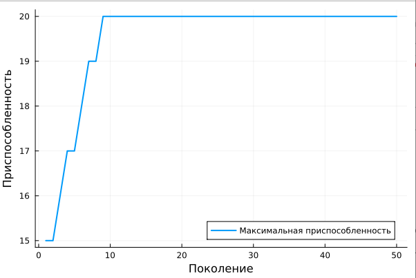

---
## Front matter
lang: ru-RU
title: Генетические алгоритмы и моделирование эволюции
subtitle: Genetic algorithms and simulation of evolution
author:
  - Латыпова Диана
teacher:
  - Кулябов Д. С.
  - д.ф.-м.н., профессор
  - профессор кафедры прикладной информатики и теории вероятностей  
institute:
  - Российский университет дружбы народов имени Патриса Лумубы, Москва, Россия
date: 21 марта 2024

## i18n babel
babel-lang: russian
babel-otherlangs: english

## Formatting pdf
toc: false
toc-title: Содержание
slide_level: 2
aspectratio: 169
section-titles: true
theme: metropolis
header-includes:
 - \metroset{progressbar=frametitle,sectionpage=progressbar,numbering=fraction}
 - '\makeatletter'
 - '\beamer@ignorenonframefalse'
 - '\makeatother'
---

# Информация

## Докладчик

:::::::::::::: {.columns align=center}
::: {.column width="70%"}

  * Латыпова Диана
  * студент НФИбд-02-21
  * Российский университет дружбы народов имени Патриса Лумумбы
  * [1032215005@rudn.ru](mailto:1032215005@rudn.ru)
  * <https://github.com/dlatypova>

:::
::: {.column width="30%"}


:::
::::::::::::::

# Вводная часть

## Актуальность

- Активно развивающаяся область исследований в контексте математического моделирования
- Предоставляют эффективные инструменты для поиска оптимальных решений. 
- Способны адаптироваться к изменяющимся условиям, использовать эвристические методы и моделировать процессы эволюции

## Цели и задачи

**Цель**: Представление основных принципов и концепций генетических алгоритмов, а также их применение в моделировании эволюции.

**Задачи**:

- Обзор основных принципов и концепций генетических алгоритмов
- Исследование применения генетических алгоритмов в моделировании эволюции
- Анализ результатов применения генетических алгоритмов на примере.

# Описание ГА

## Описание ГА

Генетический алгоритм - это алгоритм, основанный на имитации генетических процедур развития популяции в соответствии с принципами эволюционной динамики. Часто используется для решения задач оптимизации (многокритериальной), поиска, управления.

## Основные принципы ГА (1)

**Отбор**: отбираются особи с лучшей приспособленностью для размножения

$$
P(x_{i}) = \frac{f(x_{i})}{\sum _{i=1}^N f(x_{i})}
$$

## Основные принципы ГА (2)

**Скрещивание**: Отобранные особи спариваются и производят потомство

Пусть $x_{1}$ и $x_{2}$ - два родителя, а $x_{3}$ и $x_{4}$- их потомки. Тогда:

$$
x_{3} = (x_{1}[1:k]+ x_{2}[k+1 :]) $$
$$ x_{4} = (x_{2}[1:k]+ x_{1}[k+1 :])
$$

$x_{1}[1:k]$ обозначает первую часть генов от $x_{1}$ до $k$, а 
$x_{1}[k+1 :]$ - вторая часть генов от $k+1$ до конца последовательности. Аналогично для $x_{2}$

## Основные принципы ГА (3)

**Мутация**: Потомство подвергается случайным мутациям

Пусть $x$ - индивид, а $x′$ - его мутированная версия. Тогда:

$$
x′[i] = \left\{
\begin{array}{cc}
1-x[i], \\\\
x[i],
\end{array}
\right.
$$

## Основные принципы ГА (4)

**Повторение**: Процесс повторяется до тех пор, пока не будет достигнуто условие останова

Цикл:

1. Установка начальных параметров, создание начальной популяции индивидов
2. Оценка пригодности каждого индивида в популяции
3. Выполнение операторов селекции, скрещивания и мутации для создания новой популяции
4. Оценка пригодности новой популяции и проверка критерия останова. Если критерий не достигнут, возвращение к шагу 3.

# ГА в моделировании эволюции

## ГА в моделировании эволюции

В моделировании эволюции генетические алгоритмы используются для решения ряда задач:

- Моделирование эволюционных процессов
- Изучение динамики популяций
- Анализ эволюционных стратегий
- Оптимизация процессов в эволюционных системах
- Решение практических задач

# Пример применения генетических алгоритмов для моделирования эволюции популяции в простой среде.

## Пример (1)

```
# Количество особей в популяции
population_size = 100
# Количество генов у каждой особи
num_genes = 20
# Генерация начальной популяции случайным образом
function generate_population(population_size, num_genes)
    return [rand(Bool, num_genes) 
    
    for _ in 1:population_size]
end
# Генерация начальной популяции
population = generate_population(population_size, num_genes)

```

## Пример (2)

```
# Генетический алгоритм для моделирования эволюции
function genetic_algorithm(population, num_generations)
    fitness_values = Float64[]
    for generation in 1:num_generations
        # Оценка приспособленности
        fitness = [calculate_fitness(individual) 
        for individual in population]
        sorted_indices = sortperm(fitness, rev=true)
        # Отбор лучших особей для скрещивания
        selected_parents = population[sorted_indices
        [1:div(length(population), 2)]]
```

## Пример (3)
        
```        
        # Скрещивание и мутация
        new_population = []
        while length(new_population) < length(population)
            parent1, parent2 = rand(selected_parents, 2)
            child = crossover(parent1, parent2)
            child = mutate(child, mutation_rate)
            push!(new_population, child)
        end
        
        population = new_population
        push!(fitness_values, maximum(fitness))
    end
    return fitness_values
end

```

## Пример (4)

{#fig:001 width=70%}

# Выводы

## Выводы

- Рассмотрены основные принципы работы генетических алгоритмов: селекция, скрещивание, мутация и повторение
- Продемонстрировано применение генетических алгоритмов в моделировании эволюции
- Представлен практический пример применения ГА на языке программирования Julia для моделирования эволюции популяции в простой среде
