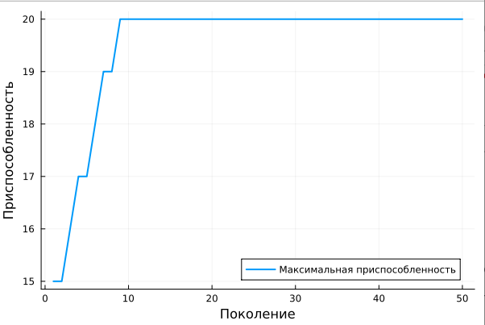

---
## Front matter
title: "Генетические алгоритмы и моделирование эволюции"
subtitle: "Genetic algorithms and simulation of evolution"
author: "Латыпова Диана"

## Generic otions
lang: ru-RU
toc-title: "Содержание"

## Bibliography
bibliography: bib/cite.bib
csl: pandoc/csl/gost-r-7-0-5-2008-numeric.csl

## Pdf output format
toc: true # Table of contents
toc-depth: 2
lof: true # List of figures
lot: true # List of tables
fontsize: 12pt
linestretch: 1.5
papersize: a4
documentclass: scrreprt
## I18n polyglossia
polyglossia-lang:
  name: russian
  options:
	- spelling=modern
	- babelshorthands=true
polyglossia-otherlangs:
  name: english
## I18n babel
babel-lang: russian
babel-otherlangs: english
## Fonts
mainfont: PT Serif
romanfont: PT Serif
sansfont: PT Sans
monofont: PT Mono
mainfontoptions: Ligatures=TeX
romanfontoptions: Ligatures=TeX
sansfontoptions: Ligatures=TeX,Scale=MatchLowercase
monofontoptions: Scale=MatchLowercase,Scale=0.9
## Biblatex
biblatex: true
biblio-style: "gost-numeric"
biblatexoptions:
  - parentracker=true
  - backend=biber
  - hyperref=auto
  - language=auto
  - autolang=other*
  - citestyle=gost-numeric
## Pandoc-crossref LaTeX customization
figureTitle: "Рис."
tableTitle: "Таблица"
listingTitle: "Листинг"
lofTitle: "Список иллюстраций"
lotTitle: "Список таблиц"
lolTitle: "Листинги"
## Misc options
indent: true
header-includes:
  - \usepackage{indentfirst}
  - \usepackage{float} # keep figures where there are in the text
  - \floatplacement{figure}{H} # keep figures where there are in the text
---

# Цель работы

Цель данного доклада состоит в том, чтобы представить основные принципы и концепции генетических алгоритмов, а также их применение в моделировании эволюции. Кроме того, доклад направлен на обсуждение математических моделей, используемых в ГА, и примера их применения в моделировании эволюции.

# Задачи

- Обзор основных принципов и концепций генетических алгоритмов
- Исследование применения генетических алгоритмов в моделировании эволюции
- Рассмотрение математических моделей, лежащих в основе генетических алгоритмов
- Рассмотрение примера применения генетических алгоритмов для моделирования эволюции популяции
- Анализ результатов применения генетических алгоритмов на примере.

# Введение

В современном мире, научные и технические задачи сталкиваются с растущей сложностью и объемом данных. Решение таких задач требует эффективных методов оптимизации и поиска, способных адаптироваться к изменяющимся условиям и находить оптимальные решения в большом пространстве возможных вариантов. В этом контексте, генетические алгоритмы (ГА) и моделирование эволюции представляют собой мощный инструмент, основанный на принципах естественного отбора и эволюции.

В данном докладе я представлю обзор основных принципов и концепций генетических алгоритмов, а также их применение в моделировании эволюции. Рассмотрю математические модели, лежащие в основе генетических алгоритмов.

# Описание ГА

Генетический алгоритм - это алгоритм, основанный на имитации генетических процедур развития популяции в соответствии с принципами эволюционной динамики. Часто используется для решения задач оптимизации (многокритериальной), поиска, управления [@first:bash].

# Основные принципы ГА

Генетический алгоритм - это эвристика поиска, вдохновленная теорией естественного отбора Чарльза Дарвина. Этот алгоритм генерирует новые решения проблемы, имитируя процесс естественного отбора. Процесс естественного отбора включает в себя четыре основных этапа [@second:bash]:

- Селекция (отбор): Выбор наиболее подходящих индивидов для размножения на основе их пригодности. Обычно используются методы, вдохновленные естественным отбором, такие как турнирная селекция или пропорциональное выборка с учетом пригодности.

Вероятность выбора индивида $x$ для скрещивания обычно определяется на основе его пригодности. Один из простых способов определения вероятности селекции - это пропорциональная селекция, где вероятность выбора индивида пропорциональна его пригодности:

$$
P(x_{i}) = \frac{f(x_{i})}{\sum _{i=1}^N f(x_{i})}
$$

где $P(x_{i})$- вероятность выбора индивида $x_{i}$ для скрещивания, $f(x_{i})$ - значение функции пригодности для индивида $x_{i}$, $N$ - общее количество индивидов в популяции.

- Скрещивание (кроссинговер): Создание новых индивидов путем комбинирования генетического материала (параметров) родителей. Этот процесс моделирует генетическую рекомбинацию.

Скрещивание индивидов может быть выполнено различными способами, но одним из наиболее распространенных является одноточечный кроссинговер. Пусть $x_{1}$ и $x_{2}$ - два родителя, а $x_{3}$ и $x_{4}$- их потомки. Тогда одноточечный кроссинговер может быть выполнен следующим образом:

$$
x_{3} = (x_{1}[1:k]+ x_{2}[k+1 :])
\\ x_{4} = (x_{2}[1:k]+ x_{1}[k+1 :])
$$

$x_{1}[1:k]$ обозначает первую часть генов от $x_{1}$ до $k$, а 
x_{1}[k+1 :] обозначает вторую часть генов от $k+1$ lо конца последовательности. Аналогично для $x_{2}$

- Мутация: Иногда случайные изменения применяются к потомству, чтобы обеспечить разнообразие в популяции и избежать застревания в локальных оптимумах

Мутация вводит случайные изменения в генетический материал индивида. Пусть $x$ - индивид, а $x′$ - его мутированная версия. Тогда один из способов внести мутацию - это инвертировать случайно выбранный бит в строке (если используется бинарное кодирование генов):

$$
x′[i] = \left\{
\begin{array}{cc}
1-x[i], \\\\
x[i],
\end{array}
\right.
$$

В первом случае если $i$ - выбранный случайный индекс, второй случай - если $i$ - не выбранный случайный индекс

- Повторение: Эти шаги повторяются на протяжении нескольких поколений, пока не будет достигнуто условие останова, такое как достижение определенного уровня пригодности или истечение предварительно заданного количества итераций.

Формально это может быть представлено следующим образом:

1. Установка начальных параметров и создание начальной популяции индивидов.
2. Оценка пригодности каждого индивида в популяции.
3. Выполнение операторов селекции, скрещивания и мутации для создания новой популяции.
4. Оценка пригодности новой популяции и проверка критерия останова. Если критерий не достигнут, возвращение к шагу 3.

Формально это представлено в виде цикла, который продолжается до выполнения критерия останова.

# ГА в моделировании эволюции

В основе генетических алгоритмов лежит принцип эволюции биологических видов через последовательное изменение и отбор наиболее приспособленных особей. Путем имитации этого процесса ГА позволяют эффективно искать решения в пространствах высокой размерности, где традиционные методы оптимизации могут оказаться неэффективными или неприменимыми [@third:bash].

В моделировании эволюции генетические алгоритмы используются для решения ряда задач, включая [@fourth:bash]:
- *Моделирование эволюционных процессов*: Генетические алгоритмы могут быть применены для моделирования эволюции биологических видов, включая процессы дивергенции, адаптации к изменяющейся среде, и эволюции генома.
- *Изучение динамики популяций*: ГА позволяют анализировать динамику изменения популяций во времени, включая изменения в частоте генетических аллелей и распределении признаков в популяции.
- *Анализ эволюционных стратегий*: Генетические алгоритмы могут быть использованы для изучения различных стратегий в эволюционных играх и конкурентных взаимодействиях в популяциях.
- *Оптимизация процессов в эволюционных системах*: ГА могут быть применены для оптимизации параметров и структур в моделях эволюционных систем, таких как модели взаимодействий хищник-жертва или модели эволюции социального поведения.
- *Решение практических задач*: Генетические алгоритмы используются для решения различных прикладных задач, таких как проектирование оптимальных сетей связи, поиск оптимальных параметров в машинном обучении и прочее.

# Пример

Применения генетических алгоритмов для моделирования эволюции популяции в простой среде [@fifth:bash]. 

Код на Julia:
```
using Random
using Plots

# Количество особей в популяции
population_size = 100

# Количество генов у каждой особи
num_genes = 20

# Вероятность мутации
mutation_rate = 0.01

# Генерация начальной популяции случайным образом
function generate_population(population_size, num_genes)
    return [rand(Bool, num_genes) for _ in 1:population_size]
end

# Функция вычисления приспособленности каждой особи
function calculate_fitness(individual)
    return sum(individual)
end

# Функция скрещивания двух особей
function crossover(parent1, parent2)
    crossover_point = rand(1:length(parent1))
    child = vcat(parent1[1:crossover_point], parent2[crossover_point+1:end])
    return child
end

# Функция мутации особи
function mutate(individual, mutation_rate)
    for i in 1:length(individual)
        if rand() < mutation_rate
            individual[i] = !individual[i]
        end
    end
    return individual
end

# Генетический алгоритм для моделирования эволюции
function genetic_algorithm(population, num_generations)
    fitness_values = Float64[]
    for generation in 1:num_generations
        # Оценка приспособленности и сортировка популяции по приспособленности
        fitness = [calculate_fitness(individual) for individual in population]
        sorted_indices = sortperm(fitness, rev=true)
        
        # Отбор лучших особей для скрещивания
        selected_parents = population[sorted_indices[1:div(length(population), 2)]]
        
        # Генерация новой популяции путем скрещивания и мутации
        new_population = []
        while length(new_population) < length(population)
            parent1, parent2 = rand(selected_parents, 2)
            child = crossover(parent1, parent2)
            child = mutate(child, mutation_rate)
            push!(new_population, child)
        end
        
        population = new_population
        push!(fitness_values, maximum(fitness))
    end
    return fitness_values
end

# Генерация начальной популяции
population = generate_population(population_size, num_genes)

# Запуск генетического алгоритма
num_generations = 50
fitness_values = genetic_algorithm(population, num_generations)

# Построение графика изменения приспособленности в течение поколений
plot(1:num_generations, fitness_values, xlabel="Поколение", ylabel="Приспособленность", label="Максимальная приспособленность", linewidth=2)

```

Код на языке Julia моделирует эволюцию популяции в простой среде, где каждая особь представлена набором генов (булевых значений). Генетический алгоритм применяется для оценки приспособленности особей, итеративного скрещивания и мутации, что позволяет анализировать изменение приспособленности в течение поколений. График показывает изменение максимальной приспособленности в каждом поколении.

Исходя из графика изменения максимальной приспособленности в каждом поколении, в общем можно наблюдать следующее:
- Динамика улучшения приспособленности: Постепенное увеличение приспособленности означает, что алгоритм успешно находит более приспособленные решения с каждым поколением.
- Сходимость к оптимуму: Указывает на то, что алгоритм находит приближенно оптимальное решение или приближается к нему.
- Нестабильность или застой: Могут свидетельствовать о проблемах в алгоритме или в модели, таких как застревание в локальных оптимумах или недостаточная разнообразие в генетическом материале.
- Неэффективность или недостаточность алгоритма: Уменьшение приспособленности с течением времени может указывать на неэффективность алгоритма или его несоответствие задаче.

В конкретно нашем случае (рис. [-@fig:001]): 

Из графика видно, что приспособленность особей растет в начале эволюции (до примерно 9-го поколения), что является ожидаемым поведением в процессе работы генетического алгоритма. Это происходит потому, что в начальных поколениях алгоритм исследует пространство решений, что приводит к нахождению более приспособленных особей.

Однако, после некоторого количества поколений (после 9-го поколения) приспособленность перестает значительно изменяться и стабилизируется (видимо достигнут локальный оптимум). 

{#fig:001 width=70%}

# Выводы

В результате, мы рассмотрели основные принципы работы генетических алгоритмов, включая селекцию, скрещивание, мутацию и повторение, а также их применение в моделировании эволюции.

Мы увидели, как генетические алгоритмы могут быть использованы для моделирования эволюционных процессов, анализа динамики популяций, изучения эволюционных стратегий и решения практических задач.

Продемонстрировано применение генетических алгоритмов на примере моделирования эволюции популяции в простой среде с использованием языка программирования Julia.

# Список литературы{.unnumbered}

::: {#refs}
:::
